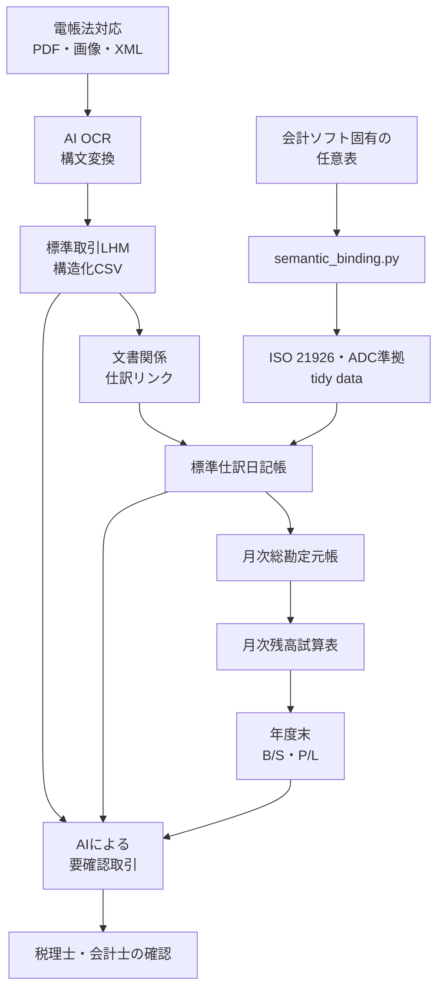

# 構造化CSVによる取引文書・会計データ統合監査基盤

> 統合プロジェクト計画・定義仕様・デモ開発手順

本書をLedger Explorer監査デモの唯一の正本文書とする。プロジェクトの目的、LHMと結合表の仕様、デモデータの開発手順、検証、運用を一つの流れで定める。

読む順序は「目的と対象 → 全体設計 → データ定義 → 変換 → デモ作成 → 検証 → 運用」とする。仕様を変更した場合は、第4章と第5章を先に更新し、第6章以降のデモと検証へ反映する。

## 目次

- [ディレクトリ概要](#ディレクトリ概要)
- [1. 目的と訴求点](#1-目的と訴求点)
- [2. 対象範囲と基準](#2-対象範囲と基準)
- [3. 全体設計と監査パッケージ](#3-全体設計と監査パッケージ)
- [4. LHM・構造化CSV・定義表](#4-lhm構造化csv定義表)
- [5. 結合表・コードリスト・変換](#5-結合表コードリスト変換)
- [6. デモ開発手順](#6-デモ開発手順)
- [7. Ledger Explorerとデモ表示](#7-ledger-explorerとデモ表示)
- [8. 検証・AI・受入基準](#8-検証ai受入基準)
- [9. 成果物と実施順序](#9-成果物と実施順序)
- [10. 運用・ライセンス・参考資料](#10-運用ライセンス参考資料)

## ディレクトリ概要

| ディレクトリ | 役割 | 同期・公開上の扱い |
|---|---|---|
| **docs/** | 本統合計画書を含むプロジェクト文書 | 中間生成物はWORKだけに保持し、利用者が明示的に承認した節目の計画書だけをGitHubへ同期する |
| **specs/** | LHM、FSM、BSM、構文・意味結合表、コードリスト、文書・事象台帳 | 定義表の公開対象。独自部分はCC BY-SA 4.0 |
| **scripts/lhm/** | FSMからBSM・LHM・構文結合表ひな型を生成・検証するPythonスクリプト | コードの公開対象。MIT License |
| **ledger-explorer-github/** | Ledger Explorer本体の公開候補実装、Web画面、サーバー、ツール、CI設定 | 配下のREADMEとCI条件に従って検証する主実装 |
| **OpenPeppol/** | ペポルのサンプル、マッピング、検討用資料 | 第三者資料の権利条件を確認し、本プロジェクト独自ライセンスで再許諾しない |
| **no+e/** | no+e記事のローカル原稿 | GitHubへ同期しない。記事媒体への公開はリポジトリ同期と分離する |
| **patches/** | Ledger Explorer実装へ適用又は比較する差分 | 適用先と目的を確認してから同期する |
| **server/** | 既存のローカルWeb・サーバー試作 | 主実装との重複を確認し、必要な成果物だけを整理する |
| **invoice/** | 請求書用作業領域 | 現在は空。公開用サンプルだけを配置する |
| **slip/** | 伝票PDF等のローカル検討資料 | 個人情報・実データを確認し、レビューなしで公開しない |
| **ledger-explorer-github-starter/**、**ledger-explorer-github-starter_fixed/** | 初期構成と修正版の比較用スナップショット | 主実装ではない。必要な差分だけを確認する |
| **work/** | 生成途中、再現性比較、抽出結果等の中間作業 | GitHubへ同期しない |
| **data/** | ローカルデータ、実行時データ、顧問先データ | GitHubへ同期しない |

WORKを唯一のCodex作業場所とし、ユーザー管理のGITディレクトリへ直接書き込まない。**work/**、**data/**、キャッシュ、秘密情報、個人情報、機械固有設定は公開成果物から除外する。

### WORKからGITへの同期範囲

ユーザーがWORKの内容を確認し、次の対応でGITへ同期する。Codexによるコピーはユーザーが明示した場合に限り、コミットとプッシュは行わない。

| WORK側 | GIT側 | 同期する内容 | 除外・注意 |
|---|---|---|---|
| **specs/** | **specs/** | LHM、FSM、BSM、結合表、コードリスト、台帳、README | 参照元のISO・ADC・ペポル原資料そのものはコピーしない |
| **scripts/lhm/** | **scripts/lhm/** | LHM生成・結合表生成・検証スクリプト、README、共通モジュール | **__pycache__/**、**.pyc**、一時出力を除外 |
| **ledger-explorer-github/.github/** | **.github/** | CI、Issue・PR設定等の変更 | 変更した場合だけ同期 |
| **ledger-explorer-github/server/** | **server/** | サーバー実装 | 実行時データ、秘密情報、ログを除外 |
| **ledger-explorer-github/tools/** | **tools/** | 変換・検証・データ準備ツール | キャッシュ、仮想環境を除外 |
| **ledger-explorer-github/web/** | **web/** | Web画面、JavaScript、CSS、静的資産 | 生成済み一時資産を除外 |
| **ledger-explorer-github/** のルート公開ファイル | GITルート | README、ライセンス、Docker、設定ひな型等の変更 | **.env**、機械固有設定、認証情報を除外 |

次のWORK側ディレクトリはGITへ一括コピーしない。

- 現段階の **docs/** と **ledger-explorer-github/docs/**。最終公開段階まで同期を保留する
- **work/**、**data/**、**no+e/**、**slip/**、**invoice/**
- **OpenPeppol/** の第三者サンプル・配布物
- **patches/**、**server/** のローカル試作
- **ledger-explorer-github-starter/**、**ledger-explorer-github-starter_fixed/**
- **.git/**、**.agents/**、**.venv/**、**venv/**、**__pycache__/**、**.pytest_cache/**

今回のLHM設計改定を同期するときは、**specs/** と **scripts/lhm/** を一組として確認する。FSMだけ、又は生成LHMだけを単独で同期すると再生成結果が一致しなくなるため、入力FSM、生成BSM、生成LHM、構文結合表ひな型、生成・検証スクリプトを同じ改定単位として扱う。**docs/** はWORK内で改定内容を追跡するが、現段階では同期せず、最終公開段階で実装済み仕様と一致することを再検証してから公開する。

## 1. 目的と訴求点

### 1.1 最初に何が変わるか

税理士・会計士は、貸借対照表や損益計算書の金額から、残高試算表、総勘定元帳、仕訳、請求書、注文、物流、決済、領収書へ同じIDをたどって戻れるようになる。

担当者が個別システムの操作方法、RDB構造、独自CSVの意味を知っていなくても、自己完結した構造化CSVと原証憑を検索・フィルタリングして調査できる。これにより、次の改善を実証する。

- 証憑探索、取引先別確認、突合、残高説明に要する時間を短縮する
- 電子帳簿保存法対応データと会計データの対応を双方向に追跡する
- 税理士の廃業、老齢化、担当交代時にも、システム依存を残さず引き継げる
- AI OCRと要確認取引の検出結果を、人が根拠へ戻って確認できる
- 元データ、変換規則、計算結果、検証結果を再現できる

### 1.2 プロジェクトの目的

ペポル BIS Billing、Post Award、Logisticsおよび決済関連文書を標準LHMへ対応付け、UBL XML、PDF・画像、構造化CSV、仕訳、元帳、試算表、年次報告の関係を共通IDで結ぶ。

過年度会計データは、会計ソフト固有の任意の表形式を未変更で保存し、UADC_PoCの **semantic_binding.py** と結合表によりISO 21926/ADC準拠会計LHMの汎用tidy data CSVへ変換する。取引XMLは、共通の **syntax_binding.py** と文書別結合表により標準取引LHMの構造化CSVへ変換する。

### 1.3 構造化CSVを採用する理由

RDBを否定するのではなく、長期保存と監査引継ぎに必要な最小単位を、データベース製品に依存しないファイルとして残す。

構造化CSVは次の性質を持つ。

- 人がテキストとして読める
- 表計算、Python、コマンドライン等で処理できる
- 階層と繰返しをディメンション列で表現できる
- LHM、結合表、コードリスト、検証結果と一緒に保存できる
- ファイル単位でハッシュを計算し、改変を検知できる
- 監査用のフラットビューを別途生成できる

### 1.4 対象外

初期デモでは、次を目的としない。

- すべてのペポル文書と全業種を網羅すること
- 税務・監査上の判断をAIに委ねること
- 会計ソフトやRDBを全面的に置き換えること
- 第三者規格資料を本プロジェクトのライセンスで再配布すること

## 2. 対象範囲と基準

### 2.1 対象事業者とデータ

デモの事業者は、食料品と日用品を扱う小売事業者とする。対象は、ある顧問先企業の次のデータである。

- 過年度の会計ソフト固有CSVまたは任意の表
- 電子帳簿保存法対応として保存されたPDF、画像、原XML
- 取引先、商品、勘定科目、税区分等のマスタ
- 仕訳日記帳、総勘定元帳、残高試算表、貸借対照表、損益計算書
- AI OCRの候補値、信頼度、座標、修正履歴

### 2.2 対象取引系列

最初のデモでは、次の三系列を完成させる。

1. 仕入：注文、出荷、受領、請求、仕入計上、支払、消込
2. 売上：注文、出荷、請求、売上計上、入金、消込
3. 経費：領収書または利用明細、経費計上、支払

各系列で、文書明細から仕訳、元帳、試算表、年次報告までを追跡可能にする。

### 2.3 参照する標準

| 分野 | 基準 |
|---|---|
| 請求 | ペポル BIS Billing |
| 受発注 | ペポル BIS Post Award |
| 物流 | ペポル Logistics |
| XML構文 | UBLおよび各BISの構文・ビジネスルール |
| 会計LHM | ISO 21926 LHMの委員会資料を基にしたADC会計プロファイル |
| 監査データ | ADS、ADC/ADCS |
| 国連コード | UNTDID、UNTDED、UNCL、UNECE Recommendations |
| 通貨・国 | ISO 4217、ISO 3166 |

仕様とコードリストは、データ生成時に使用したリリースを固定する。**https://docs.peppol.eu/logistics/2026-Q2/** は実装開始時に再確認し、確認できるまではペポル Logistics Release 1.2の確認済み公開版を基準とする。

### 2.4 標準の優先順位

同じ国連コードでも、ペポルBISが特定の版・部分集合を指定する場合は、完全なUNCLではなくBIS指定の部分集合を適用する。例として、請求書タイプにはペポルが指定する **UNCL1001-inv** を用いる。

## 3. 全体設計と監査パッケージ

### 3.1 データフロー



固有会計表から財務諸表を直接生成する経路は設けない。必ず標準会計LHMの中間ファイルと標準仕訳日記帳を経由する。

### 3.2 正本と派生データ

| 種類 | 位置付け |
|---|---|
| 原PDF・画像・XML | 改変しない証憑正本 |
| 会計ソフト固有表 | 改変しない会計原表 |
| LHM・結合表・コードリスト | 変換の意味と版を定める定義 |
| 構造化CSV・tidy data | 標準化された中間データ |
| 仕訳・元帳・試算表・B/S・P/L | 標準中間データから計算する派生データ |
| audit_view.csv | 監査・検索用の派生フラットビュー |
| validation_report.csv | 変換と計算の検証結果 |

### 3.3 自己完結型監査パッケージ

```text
audit-package/
├─ manifest.csv
├─ lhm.csv
├─ business_events.csv
├─ business_documents.csv
├─ document_relationships.csv
├─ event_document_links.csv
├─ sales_subledger.csv
├─ purchase_subledger.csv
├─ journal_entries.csv
├─ journal_document_links.csv
├─ parties.csv
├─ settlements.csv
├─ audit_view.csv
├─ evidence/
│  ├─ invoices/
│  ├─ orders/
│  ├─ logistics/
│  └─ payments/
├─ checksums.sha256
└─ validation_report.csv
```

| ファイル | 日本語での役割 |
|---|---|
| **manifest.csv** | パッケージ識別子、対象期間、使用した定義版、生成日時を記録する目録 |
| **lhm.csv** | 保存データの項目、意味、階層、型、多重度を定義する論理モデル |
| **business_events.csv** | 受注、発注、出荷、受領、請求、入金、支払等の商取引事象 |
| **business_documents.csv** | 注文書、請求書、物流、決済等の文書と、そのComposition配下に内包する商品、数量、単価、税、金額等の明細 |
| **document_relationships.csv** | 注文から出荷、請求、決済等の文書間関係 |
| **event_document_links.csv** | 商取引事象と、その事象を証明するペポル文書・証憑との関係 |
| **sales_subledger.csv** | ADC Salesを参考にした受注、出荷、売上請求、入金の補助簿 |
| **purchase_subledger.csv** | ADC Purchaseを参考にした発注、受領、仕入請求、支払の補助簿 |
| **journal_entries.csv** | ISO 21926/ADC準拠の標準仕訳データ |
| **journal_document_links.csv** | 仕訳明細と根拠文書・明細の多対多関係 |
| **parties.csv** | 事業者、取引先、金融機関等の主体マスタ |
| **settlements.csv** | 請求、支払、入金、消込、未決済残高 |
| **audit_view.csv** | 文書、仕訳、取引先、決済を横断して検索する監査ビュー |
| **evidence/** | 原PDF、画像、XML等の証憑正本 |
| **checksums.sha256** | ファイル改変を検出するSHA-256一覧 |
| **validation_report.csv** | 完全性、金額、借貸、残高、参照等の検証結果 |

## 4. LHM・構造化CSV・定義表

### 4.1 定義表の決定順序

1. JIS FSMでクラス、property、association、特化関係を定義する
2. FSMa、BSM、LHMを同じ生成経路で作成する
3. LHMから監査対象の文書種類及び最小項目を選び、構造化CSVの階層と列を定義する
4. UBL文書種類、UBL版及びXPathを構造化CSV列へ対応付ける
5. 出力対象、条件付き出力及び非出力の規則を定義する
6. 構造化CSV、UBL XML及びPDFの生成を同じ定義表から検証する

サンプル値を先に作ってLHMを合わせてはならない。

### 4.2 LHM定義CSV

UADC_PoC互換の先頭列は次のとおりとする。

```text
sequence,syntax_sequence,level,lhm_level,type,identifier,name,datatype,multiplicity,domain_name,definition,module,class_term,id,path,semantic_path,label_local,definition_local,element
```

Ledger Explorer固有列は末尾へ追加する。

```text
concept_key,source_standard,source_reference,code_list_key,code_list_agency,code_list_version,code_list_subset,code_list_uri,status
```

**type** は **C** をクラス、**A** を属性、**R** を参照関係として使用する。IDはモジュール内で一意にし、**concept_key=module:id** を全体の一意キーとする。本プロジェクト独自の共通概念には **LE-BG-nnnn** と **LE-BT-nnnn** を用いる。

原標準でReference Associationまたは **REF** とされた関係を一律にCompositionへ変更しない。取引先、商品、勘定科目、会計期間、通貨等のマスタ参照は、監査に必要な取引時点の属性を **C** のcomposite associationと **A** の子要素として展開する。原標準の参照行は **source_reference** で追跡し、展開したクラスは **status=composite-association**、子属性は **status=composite-member** とする。

仕訳日記帳、Sales、Purchase、売掛、買掛等の別補助簿に属する取引レコードへの参照、および注文書、出荷案内、受領通知、請求書、決済証憑等の独立文書への参照は **R** と **REF** を保持する。参照元には参照先の主キーだけを置き、参照先レコードの内容を下位へ複製しない。

#### 4.2.1 JIS統合LHMの定義・生成手順

JIS統合モデルは、[JIS_FSM_2026-07-19.csv](./JIS/JIS_FSM_2026-07-19.csv) を正本入力とし、次の順序で再生成する。

1. 日本語FSMのヘッダーに併記された **sequence、property_type、identifier、class_term、property_term、representation_term、associated_class、multiplicity、definition、module、table、domain_name** を論理項目として抽出する。表示用空列及び末尾空列は処理対象にせず、列の物理位置ではなくヘッダー名で識別する。
2. [AWI_21926_FSM.csv](./ISO21926/AWI_21926_FSM.csv) の英文定義と基礎クラスを参照して、ローカル日本語項目を左側、英語のモデル項目を右側に持つ **JIS_FSMa_2026-07-19.csv** を生成する。
3. **specialization.py** にFSMaを入力し、Abstract Classをそのまま具体クラス化せず、定義された特化先へpropertyとassociationを継承・置換して **JIS_BSM_2026-07-19.csv** を生成する。
4. **graphwalk.py** にBSMを入力し、Composition及びAggregationを走査して **JIS_LHM_2026-07-19.csv** を生成する。標準実行ではAggregation先のassociationも展開する。Aggregation先の直接Attributeだけを展開する限定試験では **--aggregation-attributes-only** を指定する。
5. LHMのパスはXPathではなく、**$.ルートクラス.親クラス.子property** 形式の英語セマンティックパスとする。elementは英語のproperty名を基本とし、全モデルで一意になるよう必要な親クラス名を付加する。同じクラス語を連続して重複させず、英字だけで構成する。
6. FSMa、BSM、LHMはUTF-8 BOM付きCSVとし、生成Excelの各シートをCSVと完全一致させる。definition空欄、英語欄への日本語混入、未定義関連先、非英字element、禁止列 **id、path、abbreviation_path、xpath**、CSVとExcelの差異を検証する。

再生成コマンドは次のとおりである。各入出力を省略した場合は、コマンドに示したパスが既定値として使用される。

```powershell
& '.\.venv\Scripts\python.exe' `
  '.\scripts\generate_jis_models_20260719.py' `
  '--fsm' '.\docs\JIS\JIS_FSM_2026-07-19.csv' `
  '--awi-fsm' '.\docs\ISO21926\AWI_21926_FSM.csv' `
  '--source-workbook' '.\docs\JIS\JIS_FSM_2026-07-19.xlsx' `
  '--fsma-output' '.\docs\JIS\JIS_FSMa_2026-07-19.csv' `
  '--bsm-output' '.\docs\JIS\JIS_BSM_2026-07-19.csv' `
  '--lhm-output' '.\docs\JIS\JIS_LHM_2026-07-19.csv' `
  '--workbook-output' '.\docs\JIS\JIS_FSM_2026-07-19a.xlsx'
```

取引テストデータはLHMの全項目を機械的に複製せず、文書識別、日付、取引先、決済方法、文書金額、税額、文書明細、商品、数量、単価及び独立文書へのREFという監査に必要な最小プロファイルを選ぶ。未使用の任意項目は空列として追加せず、使用項目とLHMのsemantic_path・elementの対応を生成Excelの **Structured CSV 定義** シートへ記録する。月間資金決済確認、元月間グループ、仕訳参照、仮定内容等、JIS LHMに直接存在しない監査項目はLedger Explorer拡張として区別する。

#### 4.2.2 Structured CSV定義及びUBL XPathの生成手順

JIS統合LHMの生成後、[JIS_FSM_2026-07-19a.xlsx](./JIS/JIS_FSM_2026-07-19a.xlsx) と [JIS_LHM_2026-07-19.csv](./JIS/JIS_LHM_2026-07-19.csv) を入力として、**scripts/add_structured_csv_definitions_20260720.py** を実行し、[JIS_FSM_2026-07-19b.xlsx](./JIS/JIS_FSM_2026-07-19b.xlsx) を生成する。

この処理では、FSM、BSM及びLHMのセマンティックモデル自体へXPathを追加しない。LHMの **semantic_path** と構造化CSV列、UBL XPath及び出力規則の対応を、下流処理用の別シートとして追加する。

```powershell
& '.\.venv\Scripts\python.exe' `
  '.\scripts\add_structured_csv_definitions_20260720.py'
```

現行スクリプトの入出力は次のとおりである。

| 区分 | ファイル又はシート | 用途 |
|---|---|---|
| 入力 | **docs/JIS/JIS_FSM_2026-07-19a.xlsx** | FSM、FSMa、BSM、LHMの生成済み4シートを持つ基礎Excel |
| 入力 | **docs/JIS/JIS_LHM_2026-07-19.csv** | structured_level、構造化CSV列及びUBL XPathの導出元 |
| 出力 | **docs/JIS/JIS_FSM_2026-07-19b.xlsx** | LHMへstructured_levelを追加し、Structured CSV定義と対象管理を加えた定義Excel |
| 次工程の入力 | **Structured CSV 定義** | 構造化CSV、UBL XML及びPDFの列・項目・出力規則 |
| 次工程の入力 | **Structured CSV 対象** | 文書種類、LHMルート、UBL文書1・2及びUBL版の管理 |

**JIS_FSM_2026-07-19b.xlsx** は次の6シートで構成する。

1. **JIS_FSM_2026-07-19**
2. **JIS_FSMa_2026-07-19**
3. **JIS_BSM_2026-07-19**
4. **JIS_LHM_2026-07-19**
5. **Structured CSV 定義**
6. **Structured CSV 対象**

文書種類別の **SC_文書名** シートは作成しない。文書種類ごとの出力列は、**Structured CSV 定義** を **root_class**、**column_order**、**output_status** で抽出して決定する。重複した定義シートを持たず、**Structured CSV 定義** を唯一の出力定義とする。

##### structured_level及び構造化CSV列の規則

LHMシートに追加する **structured_level** と、Structured CSV定義へ転記する列は次の規則で決定する。

| LHM行 | structured_level | Structured CSV定義への転記 |
|---|---:|---|
| ルートC | 0 | **root_dimension** として **dElement** を定義 |
| 親Cの直下のA | 親の有効レベル＋1 | **property** としてelementを定義 |
| R/C、最大多重度1 | 親の有効レベル＋1 | association行自体は転記しない |
| 最大多重度1のR/C配下のA | 親R/Cの上位クラスの有効レベル＋1 | **property** として転記 |
| R/C、最大多重度* | 親の有効レベル＋1 | **repeat_dimension** として **dXXX** を定義 |
| 最大多重度*のR/C配下のA | 繰返しR/Cのレベル＋1 | **property** として転記 |

例えば、**Sales Invoice.Customer** がC 0..1の場合、Customer行自体はStructured CSV定義へ転記せず、その配下の **Customer.Account ID** をレベル1のpropertyとする。**Invoice Line** がC 0..*の場合はレベル1の **dInvoiceLine** を定義し、**Invoice Line.Line ID** をレベル2とする。PPEルートは当面の監査対象外とし、structured_level及びStructured CSV定義を生成しない。

##### Structured CSV定義の列

列順は次のとおりである。

```text
root_sequence,root_class_local,root_class,column_order,structured_level,column_kind,structured_column,source_sequence,type,multiplicity,name_local,name,datatype_local,datatype,semantic_path,ubl_xpath,ubl_xpath2,output_status,output_rule_local,element,definition_local,definition
```

主要列の役割は次のとおりである。

| 列 | 用途 |
|---|---|
| **root_class** | 文書又は会計データのLHMルート。文書種類別抽出のキー |
| **column_order** | 同一root_class内の構造化CSV列順 |
| **structured_level** | 構造化CSVにおける階層 |
| **column_kind** | **root_dimension**、**repeat_dimension**又は**property** |
| **structured_column** | 構造化CSVへ出力する列名 |
| **semantic_path** | LHMの英語セマンティックパス |
| **ubl_xpath** | Structured CSV対象の **UBL文書1** に対応するXPath |
| **ubl_xpath2** | Structured CSV対象の **UBL文書2** に対応するXPath |
| **output_status** | **Y** は出力、**N** は非出力、**C** はデータ値に応じた条件付き出力 |
| **output_rule_local** | 非出力又は条件付き出力の日本語規則 |

XPathに複数文書をunionで記述しない。例えば、請求モデルでは **ubl_xpath** をInvoice、**ubl_xpath2** をCreditNoteに対応させ、物品移動モデルでは **ubl_xpath** をDespatchAdvice、**ubl_xpath2** をReceiptAdviceに対応させる。単一UBL文書だけに対応する場合、**ubl_xpath2** は空欄とする。これにより、UBL文書生成処理はXPath文字列を分解せず、管理シートのUBL文書列と同じ位置のXPath列を使用できる。

UBLは2.1を優先し、UBL 2.1に該当文書がない場合だけUBL 2.4を使用する。採用版は **Structured CSV 対象** の **UBLバージョン** に記録する。UBL 2.1及び2.4に直接対応する文書又は項目がない場合はXPathを空欄とし、会計帳簿モデル等を無理にUBL文書へ対応付けない。

現行の個別出力規則は次のとおりである。

| 対象 | output_status | 規則 |
|---|---|---|
| 明細行の税額及び税額内訳 | **N** | 明細では税額を計算・出力しない |
| 文書ヘッダーの税額合計 | **Y** | 税率別課税対象額から求めた文書税額合計として出力する |
| TaxExcludedAmount | **N** | 当該事業者は税込会計のため出力しない |
| 文書又は明細のNumber | **C** | 同じ文書又は明細のIDと同一値の場合は省略する |

出力調整は文書生成プログラムへ個別に埋め込まず、**output_status** と **output_rule_local** を参照して適用する。後続のUBL XML生成は電子商取引対象の事業者に適用し、非電子取引先向けのPDFは同じStructured CSV定義及び文書データから生成する。いずれも利用者がXPath確認後に明示的に指示してから実施する。

##### 編集対象と再生成時の注意

- FSM、クラス、property、association又は特化を変更する場合は、正本の **JIS_FSM_2026-07-19.csv** を修正し、まず **generate_jis_models_20260719.py** を再実行する。
- Structured CSVの対象文書、最小項目、UBL対応又は出力規則を変更する場合は、現状では **add_structured_csv_definitions_20260720.py** の対象定義及び対応規則を修正し、b版Excelを再生成する。
- b版Excelの **Structured CSV 定義** と **Structured CSV 対象** は次工程の入力定義であるが、上流生成に対しては生成物である。Excelだけを直接修正すると再生成時に失われるため、恒久的な変更は生成スクリプトへ反映する。
- 生成後は、シート名、行列数、見出し、主要XPath、UBL文書1・2との対応、output_status、数式なし、Excelテーブルなし及びopenpyxlで再読込みできることを検証する。

2026年7月20日時点の検証済み生成結果は次のとおりである。

| 検証対象 | 結果 |
|---|---:|
| LHMデータ行 | 12,861 |
| Structured CSV定義行 | 630 |
| ubl_xpath設定行 | 481 |
| ubl_xpath2設定行 | 209 |
| 明細税額の非出力行 | 45 |
| ヘッダー税額の出力行 | 21 |
| ID同値時にNumberを省略する条件付き行 | 20 |
| SC_文書名シート | 0 |
| Excelシート | 6 |
| 数式及びExcelテーブル | 0 |

### 4.3 標準取引LHM

注文、出荷、受領、請求、決済に共通する概念を抽出し、少なくとも次を表現する。

- 文書識別子、発行日、業務文書タイプ
- 売手、買手、出荷者、受領者、支払者、受取者
- 文書明細、品目、数量、単位、単価、税、金額
- 元文書・先行文書・後続文書への参照
- 支払条件、決済方法、入金・支払・消込
- 原証憑、OCR結果、仕訳明細へのリンク

ADCでは文書と明細を別表として定義しているが、本プロジェクトの標準取引LHMでは、明細を文書から独立したルート表にしない。注文、出荷、受領、請求等の各文書クラスをルートとし、0件以上の明細クラスをComposition配下へ展開する。各明細は文書IDと明細IDで識別できるようにし、品目、数量、単位、単価、税、金額を同じ文書階層に保持する。明細から別の注文書、出荷案内、請求書又は仕訳入力を参照する場合は、その参照キーを **REF** として保持する。

したがって、監査パッケージには独立した **document_lines.csv** を置かず、**business_documents.csv** の階層型構造化CSVに文書行と明細行を格納する。親文書は **dBusinessDocument**、繰返し明細は **dDocumentLine** 等のディメンション列で区別する。文書間の多対多関係と、仕訳明細から文書又は特定文書明細への関係だけは、横断検証のため独立した結合表に保持する。

文書交換プロファイル、文書自身の業務タイプコード、参照先文書タイプコードは別項目として扱う。

### 4.4 ISO 21926/ADC準拠会計LHM

会計整合性確認の中間形式は、**ISO-21926-Logical-Hierarchical-Model_2025-04-01.xlsx** の **Classes** を基準とする。デモ用部分集合は [adc-accounting-lhm-profile.csv](../specs/lhm/adc-accounting-lhm-profile.csv) で管理する。

最小プロファイルは次のクラスを含む。

- **Accounting Period**
- **Ledger Account**
- **General Ledger Journal Entry**
- **General Ledger Journal Entry Line**
- **General Ledger Period Balance**
- **General Ledger Trial Balance**

2025年版LHMの **Status=M/O** は、プロファイル内で必須 **1..1** / 任意 **0..1** に正規化する。委員会資料の定義文は転載せず、出典行番号とデモに必要な識別子、パス、型、多重度、XMLタグだけを保持する。

仕訳と電子証憑は、**General Ledger Journal Entry Line/Bill** の文書IDを **REF** として接続する。日付、種類コード、明細等は参照先文書で保持し、仕訳明細の下位へ複製しない。取引先ID等、標準LHMに直接置けない情報は、出典を明示したLedger Explorer拡張として分離する。

マスタに対するReference Associationの展開は、参照時点ではなく取引・記帳時点のマスタ内容を保存するスナップショットとする。これにより、後日マスタの名称や分類が変更されても、保存時点の意味を単一ファイルから再現できる。独立したマスタCSVは入力検証や変更履歴の確認には利用できるが、仕訳、元帳、試算表、証憑を読むための必須JOINにはしない。一方、別補助簿又は独立文書への参照はスナップショット展開せず、REFで参照先をたどる。

ADC会計LHMの最小プロファイルでは、次のように展開する。

| マスタ又は同一補助簿内の参照先 | composite associationに保持する子属性 |
|---|---|
| **Accounting Period** | 会計年度、会計期間ID |
| **Currency** | ISO 4217通貨コード |
| **Ledger Account** | 勘定科目コード、勘定科目名、財務諸表表示科目、残高借貸区分 |
| 親 **General Ledger Journal Entry** | 仕訳ID、仕訳番号、有効日、摘要、会計年度、会計期間ID |

金額には **Amounts**、**(Functional) Amount**、**Currency** のクラス行を明示する。根拠文書の **Bill** は **R**、文書IDは **REF** とし、参照先文書の日付、種類、明細を仕訳明細の下位へ展開しない。

仕訳日記帳は受注・発注・出荷等の非会計事象を保持しないため、ADC Sales／Purchaseを参考に次の補助簿を別に定義する。

| 補助簿 | ADCクラス | 対応する主な商取引事象 |
|---|---|---|
| Sales | **Sales Order**、**Sales Shipment Made**、**Sales Invoice**、**Account Receivable Cash Received**、**Account Receivable Cash Application** | 受注、出荷、売上請求、入金、入金消込 |
| Purchase | **Purchase Order**、**Purchase Materials Received**、**Purchase Invoice**、**Account Payable Payment Made**、**Account Payable Cash Application** | 発注、検収・受領、仕入請求、支払、支払消込 |

商取引事象の標準ID、順序、ADCクラス、ペポル文書タイプ、会計効果、仕訳リンク要否は [business-event-type-registry.csv](../specs/registries/business-event-type-registry.csv) で定義する。注文、注文応答、出荷案内、受領通知は原則として仕訳リンクを要求しない。売上・仕入の認識、入金・支払、債権債務の消込は仕訳リンクを要求する。出荷・受領時の在庫又は売上原価の認識は顧問先の会計方針に従って条件付きとする。

補助簿内の得意先、仕入先、商品等のマスタ属性と、文書が所有する明細、金額・通貨、数量・単位はCompositionで展開する。関連文書と他補助簿の仕訳入力は **R** と **REF** で参照する。例えば、売掛台帳から仕訳日記帳へは仕訳入力番号だけを参照し、仕訳日付、摘要、勘定科目、金額等を売掛台帳の下位へ展開しない。請求書から注文書、出荷案内又は受領通知を参照する場合も、参照先文書IDを **REF** とする。

### 4.5 階層型構造化CSV

列順は、ルート・繰返しクラスのディメンション列を先頭にし、その後へLHM属性のファクト列を置く。ディメンション列は **d<ClassTerm>** とし、発生番号は1から始める。

```csv
dBusinessDocument,dDocumentLine,DocumentID,IssueDate,DocumentBusinessTypeCode,LineID,ItemName,Quantity,UnitCode,LineAmount
1,,INV-DEMO-001,2026-04-30,380,,,,,
1,1,,,,1,デモ商品A,10,EA,10000
```

親行には親の値、子行には子の値を置き、同じ値を全行へ重複させない。監査用に一行へ展開した結果は **audit_view.csv** として別に生成する。

## 5. 結合表・コードリスト・変換

### 5.1 UBL構文結合表

**syntax_binding.py** が使用する互換コア列は次のとおりである。

```text
sequence,level,structured_csv_level,type,identifier,name,datatype,multiplicity,domain_name,definition,module,class_term,id,semantic_path,label_local,definition_local,structured_csv_column,element,xpath
```

末尾に、ルート要素、名前空間、UBL版、XSD、要素順、固定値、条件、コードリスト、出典、状態等を追加する。

**syntax_binding.py** は文書別の専用変換プログラムではない。Invoice、Order、Order Response、Despatch Advice、Receipt Advice、Transport Execution Plan、Waybill等は、同じプログラムへ文書タイプ台帳とXPath結合表を差し替えて処理する。

XPathは名前空間接頭辞を明示し、属性には **/@attribute** を使用する。複数候補、条件、固定値、計算値は結合表へ記録し、プログラムへ文書固有ロジックを埋め込まない。

LHMのひな型は、FSMを **specialization.py** でBSMへ具体化し、Compositionを **graphwalk.py** で展開して生成する。FSM、BSM、LHMにはXPathを保持せず、生成LHMのセマンティックパスから **build_syntax_binding.py** で構文結合表ひな型を生成する。ペポル文書別のUBL XPath、名前空間、属性、条件、コードリストは構文結合表で確定し、**syntax_binding.py** で検証する。

JIS統合モデルの現行経路では、**JIS_FSM_2026-07-19b.xlsx** の **Structured CSV 定義** が、監査対象の最小LHM項目、構造化CSV列、UBL XPath及び出力規則を統合した次工程入力である。**ubl_xpath** と **ubl_xpath2** は、それぞれ **Structured CSV 対象** の **UBL文書1** と **UBL文書2** に一対一で対応し、union XPathは使用しない。従来の互換構文結合表を使用する場合は、この2列のうち対象UBL文書に対応する列を1本の **xpath** として渡すアダプタを設ける。

XPathだけではUBL XMLを完全には生成できない。次工程では、文書ごとのルート名前空間、**cac**・**cbc**名前空間、XSD、要素順、必須固定値、Customization ID、Profile ID、文書業務タイプコード、コードリスト及び条件を管理定義へ追加し、UBL 2.1を優先してXSD検証する。UBL 2.1に対象文書がない場合だけUBL 2.4を使用する。

### 5.2 セマンティック結合表

**semantic_binding.py** の互換コア列は次のとおりである。

```text
field_no,field_name,level,flat_file_data_type,length,description,source_document,semantic_path,type,multiplicity
```

Ledger Explorerでは次を追加する。

| 列 | 内容 |
|---|---|
| **source_column** | 顧問先固有表の実在する列名 |
| **target_column** | 標準tidy dataまたはADC出力の列名 |
| **default_value** | 元データが空の場合の既定値 |
| **required** | 必須項目 |
| **transformation_rule** | 型変換、分割、連結、行展開、計算 |
| **mapping_status** | **direct**、**transformed**、**approximated**、**missing**、**not_applicable** |
| **source_reference** | LHM、ADS、ADC等の出典 |

現行の **semantic_binding.py** は **semantic_path** の末尾から元列名を導出する。後方互換を保ちながら、**source_column** があれば優先し、なければ従来どおり導出する契約へ拡張する。

### 5.3 任意会計表から標準tidy dataへの変換

外部入力は、会計ソフトから出力した仕訳表、元帳表、残高表、マスタ表等の任意形式とする。入力表自体がtidy dataであることは要求しない。

[accounting-csv-semantic-binding-template.csv](../specs/bindings/semantic/accounting-csv-semantic-binding-template.csv) を基に、顧問先、会計ソフト、年度ごとの結合表を作る。

借方・貸方を横持ちする表は、次の標準明細へ展開する。

| 元表 | 標準LHM |
|---|---|
| 借方金額・貸方金額 | **Debit or Credit Code** と正の **Functional Amount/Value** |
| 借方科目・貸方科目 | 借貸側に対応する **Ledger Account/Account Number** |
| 証憑番号・日付・種類 | **General Ledger Journal Entry Line/Bill** |
| 伝票番号 | 仕訳ヘッダーIDと明細から親仕訳への参照 |

現行実装は複数列を複数明細行へ展開する **unpivot** をまだ持たない。顧問先専用プログラムを作らず、**transformation_rule** を解釈する共通機能として **semantic_binding.py** へ追加するまでは、会計結合表を設計契約として扱う。

### 5.4 ADC/ADCSへの対応

ADC列との結合は、**20241104_ADS_LogicalHierarchicModel_ADCS_binding_2014-11-06.xlsx** の **Classes** にある **ADCS Table** と **ADCS Name** を参照する。

[adc-gl-details-semantic-binding.csv](../specs/bindings/semantic/adc-gl-details-semantic-binding.csv) で **GL_Details** との対応を定義する。次に **GL_Accounts_Period_Balance** を追加し、月次の期首、借方、貸方、期末残高をADC列と突合する。

### 5.5 コードリストと文書タイプ台帳

コードリストは、台帳と値表を分離する。

- [code-list-registry.csv](../specs/codelists/code-list-registry.csv)：識別子、機関、版、部分集合、適用項目、出典
- [code-values-template.csv](../specs/codelists/code-values-template.csv)：コード、名称、有効期間、状態
- [document-type-registry.csv](../specs/registries/document-type-registry.csv)：文書交換プロファイル、UBLルート、業務タイプコード、結合表

初期候補には、ペポル指定のUNCL1001、UNCL4343、UNECE Recommendation 20、ISO 4217、ISO 3166、物流文書タイプを含める。現在の台帳行には確認済みと要確認が混在するため、**status** を見て採用可否を判断する。

## 6. デモ開発手順

### 6.1 工程1：定義表とLHMを確定する

1. 対象文書の版、Customization ID、Profile ID、UBLルートを登録する
2. 対象電文のLHMを決定する
3. Code型項目のコードリストと版を決定する
4. LHMとUBLのXPath結合表を作成する
5. 会計LHMとADC列の結合表を作成する
6. UADC_PoCの共通プログラムで最小変換を確認する

完了条件は、プログラム本体を文書別に変更せず、定義表の差替えだけで対象を変更できることである。

### 6.2 工程2：事業者・取引先・商品マスタを定義する

取引先マスタには、内部ID、元システムID、法人名、登録番号、所在地、国、ペポルEndpoint ID、支払条件、通貨、状態を含める。

商品マスタには、商品ID、元システムID、名称、分類、JAN等の識別子、標準単位、仕入・販売単価、税区分、在庫・売上原価・売上科目を含める。

元システムの値は上書きせず、標準IDとの対応表を保持する。

### 6.3 工程3：仕訳から候補取引と明細を設計する

Ledger Explorerの具体的な仕訳から、デモ対象を選ぶ。候補は次を優先する。

- 取引先が識別できる
- 注文、請求、決済等の系列を説明できる
- 税、数量、単価、商品明細へ合理的に展開できる
- 月次残高と年次報告への影響が確認できる

既存仕訳の金額と会計事実は変えない。商品・数量・単価等を仮定した場合は、仮定ID、対象仕訳、根拠、作成者、確認状態を仮定台帳へ記録する。

### 6.4 工程4：取引時系列と決済を作成する

注文日、出荷日、受領日、請求日、計上日、支払期日、支払日、消込日を並べ、文書関係を登録する。

決済では、請求額、支払額、値引、手数料、相殺、未決済残高を取引先・通貨・請求単位で管理する。月次の入出金伝票を根拠に、支払依頼、支払案内、入金、消込を仮定する。

### 6.5 工程5：経費証憑を作成する

消耗品、旅費交通費、水道光熱費等の経費仕訳に対応する領収書または利用明細を作成する。少なくとも、取引日、取引先、登録番号、明細、税率、税額、合計、支払方法、仕訳リンクを持たせる。

PDF・画像から取得した値は候補値とし、原本ページ、座標、信頼度、OCRモデル、処理日時、修正前後の値、確認者を保持する。

### 6.6 工程6：整合性と完備性を検証する

不整合を見つけた場合はサンプル値だけを直さず、原因を次へ戻す。

- LHMの意味・多重度不足 → 第4章
- XPath・列・コード変換誤り → 第5章
- 取引先・商品・科目対応誤り → 工程2
- 明細仮定・時系列誤り → 工程3または工程4
- 証憑作成誤り → 工程5

すべての修正は再変換・再計算し、検証報告とハッシュを更新する。

## 7. Ledger Explorerとデモ表示

### 7.1 必要な画面機能

- 仕訳日記帳からPDF・XML・構造化CSVを開く
- 総勘定元帳、試算表、B/S、P/Lから仕訳と証憑へドリルダウンする
- 取引先別に文書、仕訳、決済、残高を表示する
- 注文から出荷、請求、決済までの時系列を表示する
- OCR候補、修正履歴、要確認理由を表示する
- 元データ、変換版、検証状態、ハッシュを表示する

### 7.2 デモシナリオ

1. 請求書から仕訳、元帳、試算表、B/S・P/Lへ進む
2. B/S・P/Lから取引先、仕訳、請求書へ戻る
3. **audit_view.csv** を表計算またはコマンドで絞り込む
4. 新しい担当者がREADMEと定義表だけで同じ監査パッケージを再計算する
5. AIが挙げた要確認取引から根拠証憑と判定理由を確認する

### 7.3 表示上の原則

貸借対照表と損益計算書は、勘定科目マスタの **Financial Statement Caption** 等を用いて集計する。取引先別表示は財務諸表の正式表示を置き換えず、補助的なドリルダウンとして提供する。

## 8. 検証・AI・受入基準

### 8.1 必須検証

| 分類 | 検証内容 |
|---|---|
| 原表 | 行数、期間、文字コード、列、ハッシュ |
| 仕訳 | 仕訳件数、明細件数、借方合計＝貸方合計 |
| 科目 | 科目コードの存在、借貸区分、財務諸表集計先 |
| 文書 | 必須項目、明細合計、税、通貨、文書タイプ |
| 関係 | 参照先IDの存在、循環・孤立・重複 |
| REF | 参照先補助簿・文書の存在、キー一意性、対象期間、参照漏れ、誤参照 |
| 決済 | 請求額－支払・入金・調整＝未決済残高 |
| 月次 | 期首＋借方－貸方＝期末、前月期末＝翌月期首 |
| 年次 | 月次集計＝年度残高、試算表＝B/S・P/L |
| 証憑 | ファイル存在、ハッシュ、仕訳リンク、OCR出典 |

### 8.2 AIの役割

AIは、次の要確認候補を検出する。

- 金額・税・日付・取引先の不一致
- 証憑または仕訳リンクの欠落
- 重複文書・重複支払の可能性
- 通常と異なる勘定科目、摘要、金額、時期
- OCR信頼度が低い項目
- 決済残高や月次繰越の異常
- REFの参照先欠落、誤った文書系列、同一参照の不自然な重複
- 請求書と参照先の注文・出荷・受領について、取引先、品目、数量、日付、金額の不一致
- 売掛・買掛台帳が参照する仕訳入力について、会計効果、日付、金額、消込状態の不一致

AIは監査結論を出さない。REFの不一致も要確認候補として提示し、検出規則、モデル、理由、参照元ID、参照先ID、信頼度、人による確認結果とコメントを保存する。

### 8.3 完備性の分類

各取引を次に分類する。

- **complete**：必要な文書、明細、仕訳、決済、証憑が揃い、検証合格
- **complete_with_assumption**：仮定を含むが根拠と承認が記録されている
- **incomplete**：必須文書・明細・参照が不足
- **inconsistent**：金額、税、日付、残高、参照が不一致
- **not_applicable**：対象取引では不要

### 8.4 受入基準

- 原表を変更せず、結合表だけで標準tidy dataを再生成できる
- 標準tidy dataから同じ仕訳日記帳を再生成できる
- 仕訳の借方・貸方が一致する
- 月次元帳、試算表、年度末B/S・P/Lが連続して一致する
- 文書明細、税、合計、決済残高が一致する
- 年次報告から原証憑まで双方向に追跡できる
- PDF・XML・CSVのハッシュを再計算できる
- AIの要確認結果から根拠と人の確認記録へ戻れる
- 別担当者がRDBなしで監査パッケージを検索・再検証できる

## 9. 成果物と実施順序

### 9.1 成果物

- 本統合計画書
- 取引LHMとADC会計LHMプロファイル
- ADC Sales／Purchase補助簿LHMと商取引事象台帳
- FSM、BSM、graphwalk生成LHM
- UBL XPath構文結合表
- 固有会計表セマンティック結合表
- ADC/ADCS結合表
- コードリスト・文書タイプ台帳
- 事業者・取引先・商品・勘定科目マスタ
- デモ取引文書、PDF・XML、構造化CSV
- 標準仕訳、元帳、試算表、B/S、P/L
- 監査パッケージと検証報告
- Ledger Explorerの証憑・取引先ドリルダウン機能

### 9.2 実施フェーズ

| フェーズ | 内容 | 完了条件 |
|---|---|---|
| A | 定義表、LHM、コードリスト、結合表 | 最小変換と参照検証が合格 |
| B | マスタと会計原表変換 | 原表と標準仕訳が一致 |
| C | 仕入・売上・経費のデモ文書 | 文書明細で仕訳を説明可能 |
| D | 決済・月次・年次整合性 | 残高とB/S・P/Lが一致 |
| E | Ledger Explorer表示 | 双方向ドリルダウン可能 |
| F | AI OCR・要確認取引 | 根拠付きで人が確認可能 |

AI機能は、LHM、結合表、ID、検証規則が安定してから実装する。no+e記事は、デモが実データで動作する段階で実装状況を反映して更新する。

### 9.3 現在の実装状況

- UADC_PoC互換の定義表フォーマット：作成済み
- ペポル文書タイプ・コードリスト台帳：候補作成済み、版の最終確定は未完了
- JIS統合FSM、FSMa、BSM及びLHM：**generate_jis_models_20260719.py** で再生成済み
- LHM structured_level、監査用最小項目、構造化CSV列及び出力規則：**add_structured_csv_definitions_20260720.py** で生成済み
- UBL対応：UBL文書1・2、UBL版、**ubl_xpath**、**ubl_xpath2** を **JIS_FSM_2026-07-19b.xlsx** に定義済み。XPathの利用者確認、XSD及び実XMLによる全件検証は未実施
- Structured CSV定義Excel：FSM、FSMa、BSM、LHM、Structured CSV定義、Structured CSV対象の6シートに整理済み。重複する **SC_文書名** シートは廃止
- ADC会計LHMプロファイル：最小部分集合を作成済み
- ADC **GL_Details** 結合表：作成済み
- **specialization.py**、**graphwalk.py**、**utils.py**：追加済み
- ADC会計LHM：マスタと同一仕訳内要素をComposition展開し、根拠文書を **R** 1件・**REF** 1件として生成済み
- ADC Sales／Purchase補助簿LHM：受発注、出荷・受領、請求、入出金、消込の最小モデルを生成済み
- 補助簿間・文書間参照：Sales、Purchaseとも **R** 13件・**REF** 13件を生成し、各参照に主キーがあることを確認済み
- 商取引事象台帳：15事象をADCクラスとペポル文書タイプへ対応済み
- **build_syntax_binding.py**：追加済み、会計・Sales・Purchaseの構文結合表ひな型を生成済み
- 構文結合表の名前空間、XSD、要素順、必須固定値及びコードリスト：要確定
- **syntax_binding.py** の最小変換試験：実施済み
- **semantic_binding.py** の既存方式による最小試験：実施済み
- **source_column** と **unpivot** の汎用拡張：未実装
- デモ用企業・商品マスタ、開始月取引文書、決済及び文書関係：仮定データを生成済み。現行Structured CSV定義に基づく文書種類別CSV、UBL XML及びPDFへの再生成は未実施
- Ledger Explorerの取引先ドリルダウン、仕訳起点のAR/AP関連文書ペイン、文書起点の逆方向検索、消込及び会計データの不一致表示：実装済み。実PDF・UBL表示は未実装

工程別の到達点は次のとおりである。

| 工程 | 現在の状態 | 判定 |
|---|---|---|
| A 定義表、FSM・BSM・LHM、Structured CSV定義 | 再生成経路と定義Excelを整備済み。XPathの利用者確認とXMLスキーマ検証が残る | ほぼ完了 |
| B マスタと会計原表 | 企業、担当者、商品、仕訳、開始残高のテスト入力を整備済み。汎用会計表変換は未実装 | 一部完了 |
| C 仕入・売上・経費のデモ文書 | 商品明細と関連文書の仮定データを生成済み。文書種類別Structured CSV、UBL及びPDFは未生成 | 一部完了 |
| D 決済・月次・年次整合性 | 開始月の売掛・買掛残高、請求、返還、入出金、相殺を照合済み。UBL/PDFと仕訳の全件突合は未実施 | 一部完了 |
| E Ledger Explorer表示 | AR/APの取引先絞込み、仕訳起点・文書起点の相互検索、関連文書、消込及び不一致表示を実装済み。PDF・UBL参照と財務諸表から文書までの連続追跡が残る | 一部完了 |
| F AI OCR・要確認取引 | 設計前提だけを記載 | 未着手 |

次に着手する作業は次の順序とする。

1. **Structured CSV 定義** のXPathを利用者が確認し、修正を生成スクリプトへ反映する。
2. UBL文書ごとの名前空間、XSD、要素順、必須固定値、Customization ID、Profile ID及びコードリストを管理定義へ追加する。
3. **JIS_FSM_2026-07-19b.xlsx** を入力として、文書種類ごとのStructured CSVを別ファイルで生成する。未使用項目は列として出力せず、**output_status** と **output_rule_local** を適用する。
4. 電子商取引対象の事業者について、**UBL文書1／ubl_xpath** 又は **UBL文書2／ubl_xpath2** からUBL XMLを生成し、XSD及び必要なSchematronで検証する。
5. 非電子取引先について、同じStructured CSV文書データから表示用PDFを生成し、文書番号、日付、取引先、商品明細、税込合計及びヘッダー税額合計を照合する。
6. 注文、出荷・受領、請求・返還、入出金・支払及び消込のREFと、仕訳明細との多対多対応を全件検証する。
7. Ledger Explorerで実装済みの仕訳起点・文書起点AR/AP相互検索を基礎に、UBL／PDF参照及び財務諸表から文書までの連続追跡を実装する。
8. 最後にOCR及び要確認取引の検出を追加する。

### 9.4 最小変換試験を実施した理由と修正内容

ここでいう「実施済み」は、UADC_PoCの既存変換プログラムを変更せず、Ledger Explorerで作成した定義表を差し替えて最小データを変換できることを確認した、方式確認段階の結果である。ペポルの全電文、全項目、繰返し明細、コードリスト検証、任意会計表の汎用変換が完成したことを意味しない。

#### syntax_binding.py

試験の目的は、文書種類ごとの変換プログラムを作らず、共通プログラムとXPath結合表の組合せでUBLから構造化CSVを生成できることを確認することである。完全なLHMと結合表を作成する前にこの経路を確認しておかないと、定義表の完成後に既存プログラムと列名や階層表現が合わない問題が判明するため、請求書の文書番号、発行日、文書業務タイプコードを対象とする最小試験を先行した。

Ledger Explorer側では、UBL構文結合表の先頭部分をUADC_PoCの互換コア列に合わせ、**sequence**、**level**、**structured_csv_level**、**type**、**semantic_path**、**structured_csv_column**、**element**、**xpath** を既存プログラムが読める名称と配置にした。クラス行を **C**、属性行を **A** とし、UBL名前空間接頭辞を含むXPathを設定した。また、監査根拠、コードリスト、検証規則等のLedger Explorer固有列は互換コア列の後ろへ追加し、既存プログラムが必要な列をそのまま読める構造にした。

この試験で確認したのは、最小UBL XMLの値をXPathで取得し、**dBusinessDocument** を持つ階層型の構造化CSVへ出力できることである。明細の繰返し、請求書以外のPost Award・Logistics電文、属性値、条件分岐、逆変換、スキーマ検証は、各文書のLHMとXPath結合表を確定した後の試験対象である。

#### semantic_binding.py

試験の目的は、構造化CSVから監査・会計用の別形式を生成する後段でも、UADC_PoCの既存プログラムとセマンティック結合表を再利用できることを確認することである。現行プログラムは、結合表の **semantic_path** の末尾から入力列名を導出し、**field_name** を出力列名として扱う。この既存方式で、同名列を直接対応付ける最小変換が成立することを先に確認した。

Ledger Explorer側では、セマンティック結合表にUADC_PoC互換の **field_no**、**field_name**、**level**、**semantic_path**、**type**、**multiplicity** を残し、入力CSVの列名と **semantic_path** の末尾が一致する直接対応を定義した。その後ろに **source_column**、**target_column**、**default_value**、**required**、**transformation_rule**、**mapping_status**、**source_reference** を追加し、将来の汎用変換と監査証跡に必要な契約を表現した。

この試験で確認したのは既存方式による直接対応だけである。顧問先固有の列名を **source_column** で明示する機能、**target_column** の優先使用、日付・符号等の変換規則、借方・貸方の横持ち列を複数仕訳明細へ展開する **unpivot** は未実装である。したがって、任意会計表から標準tidy dataへ変換する次段階では、後方互換を維持しながら **semantic_binding.py** をこれらの追加列に対応させ、変換前後の件数、金額、借貸一致を別途検証する。

### 9.5 計画改定内容

2026年7月15日時点で、会計仕訳だけでは受発注、出荷・受領、請求前後の商取引事象を表現できないこと、ならびにマスタ参照と補助簿・文書間参照を区別する必要があることを踏まえ、開発計画を次のように改定した。

| 改定対象 | 当初の考え方 | 改定後 | 改定理由・効果 |
|---|---|---|---|
| ADC LHMの参照 | Reference Associationを一律に参照又は一律に展開 | マスタ参照はCompositionでスナップショット展開し、別補助簿・独立文書への参照は **R**・**REF** を保持 | 自己完結性を確保しながら、独立レコードの重複保存と不整合を防ぐ |
| 文書と明細 | ADCと同様に文書表と明細表を分離 | 文書をルートとし、繰返し明細をComposition配下に含む一つの階層型構造化CSVとして保存 | 文書単位でファイルを読めばヘッダーと全明細が揃い、別表とのJOINが不要になる |
| 会計と商取引の境界 | 仕訳日記帳を中心に全事象を表現 | 財務的影響は仕訳日記帳、受発注・物流・請求・決済の経過はSales／Purchase補助簿で表現 | 注文や出荷のために実在しない仕訳を作らず、文書と会計認識の違いを説明できる |
| 取引の追跡 | 文書相互の参照関係を中心に管理 | 商取引事象台帳、事象と文書の結合表、文書相互の関係表を分離 | 一つの事象に複数文書がある場合や、文書がない事象も時系列で追跡できる |
| 構文結合表 | 文書ごとに手作業で作成 | FSMからBSM、LHM、構文結合表ひな型を同じ生成経路で作成 | LHMとXPath結合表の行漏れ・階層不一致を抑え、再生成できる |
| マスタ参照 | 正規化したマスタを参照して表示時に結合 | マスタは入力検証に残し、監査パッケージには取引時点の必要属性をスナップショットとして展開 | 長期保存後もRDBや外部マスタなしで意味を読める |
| 検証順序 | デモ文書の作成後にモデルを調整 | モデル生成と自動検証を先に固定し、その後にマスタ、文書、仕訳、決済を作成 | 後工程でのID、階層、列名の作り直しを減らす |

改定後の実施順序は次のとおりとする。

1. ADC会計、Sales、PurchaseのFSMを定義し、CompositionをBSM・LHMへ展開する
2. ペポル文書タイプ、UN/CEFACT・UNTDED等のコードリスト、UBL XPathを確定する
3. 小売業者を想定した企業、取引先、商品、勘定科目のマスタと、対象仕訳を選定する
4. Sales／Purchase補助簿の商取引事象を設計し、受発注、物流、請求のデモ文書を作成する
5. 入出金伝票から月次決済、消込、経費証憑を定義し、仕訳との対応を設定する
6. 仕訳、補助簿、文書、決済、元帳、試算表、B/S・P/Lの整合性と完備性を検証する
7. Ledger Explorerのドリルダウン、PDF参照、AI OCR、要確認取引の検出を実装する

電文と仕訳日記帳の対応は、文書ヘッダーへの仕訳番号の単純転記ではなく、**電文明細IDと「仕訳入力番号＋仕訳明細番号」の複合キーを結ぶ多対多の対応レコード**として実装する。対応レコードには対応金額、対応税額、対応役割、対応方法及び対応状態を保持する。仕訳日記帳から根拠電文へ辿る証憑突合（vouching）と、電文から計上仕訳へ辿る網羅性確認（tracing）の双方を可能にするため、Ledger Explorerはこの対応レコードに対して、仕訳複合キー起点の索引 **IX_JournalLineMatch_Journal（仕訳入力番号、仕訳明細番号）** と、電文明細起点の索引 **IX_JournalLineMatch_Document（文書ID、電文明細ID）** を持つ。前者は仕訳から根拠電文を検索し、後者は電文の計上済み・未計上及び対応仕訳を検索するためのもので、同じ対応データを二重保存する意味ではない。明細を持たない入出金電文等は、電文自身を一つの事象明細として同じ対応方式へ接続する。

JISC請求モデルでは、請求書と返還請求書を別クラスへ増殖させず、共通の **JISC Invoice** と **JISC Invoice Line** に **Invoice Type Code** を保持する。Sales及びPurchaseへの展開時だけ専用Invoice LineのCompositionへ置換する。決済関連も銀行送金通知、手形、手数料、入金、支払及び消込ごとの文書クラスを増やさず、共通の **Settlement Message** に **Message Type Code**、決済方向、決済方法、取引チャネル、文書形態及び固有propertyを追加して識別する。電子取引と非電子取引は同じLHMを使用し、取引チャネルコードの値で区別する。

仕訳日記帳には、実際に会計認識された取引だけを記録する。注文、注文応答、出荷等についてはSales／Purchase補助簿へ商取引事象を追加し、請求認識、入出金、消込等の財務的影響が生じた時点で仕訳へ結び付ける。

### 9.6 テスト環境整備状況

モデルと結合表を人手で修正した結果ではなく、同じ入力から再生成できることを確認するため、WORKディレクトリ内に標準ライブラリだけで動作する最小テスト環境を整備した。

| 項目 | 整備状況 |
|---|---|
| 実行環境 | Windows、PowerShell、Python 3.10.2で確認済み |
| Pythonの起動 | 通常の **python** はPATH未登録。Python Launcherの **py -3.10** または明示したPython 3.10実行ファイルを使用 |
| 外部依存 | LHM生成・検証スクリプトはPython標準ライブラリだけを使用 |
| 入力 | **specs/models/fsm/** の会計、Sales、Purchase FSM |
| 生成経路 | FSM → **specialization.py** → BSM → **graphwalk.py** → LHM → **build_syntax_binding.py** → 構文結合表ひな型 |
| 一括検証 | **scripts/lhm/validate_generated_models.py** でCSV列数、ルート、CompositionとREFの境界、REF主キー、事象参照、文書タイプ、行数を検証 |
| 再生成手順 | **scripts/lhm/README.md** に会計、Sales、Purchaseの実行順と引数を記載 |
| 一時生成物 | **work/** に出力して照合後に削除し、公開対象へ含めない |

2026年7月15日に確認した結果は次のとおりである。

| 検証項目 | 結果 | 確認内容 |
|---|---|---|
| Python構文検査 | 合格 | LHM関連の5スクリプトを **py_compile** で検査 |
| FSMからBSM・LHMへの生成 | 合格 | 会計、Sales、Purchaseの3モデルを同じ手順で再生成 |
| CompositionとREFの境界 | 合格 | マスタと所有要素はComposition、別補助簿・独立文書は **R**・**REF** として生成 |
| REF主キー | 合格 | 会計1件、Sales 13件、Purchase 13件の全 **R** に対応する **REF** 主キーが存在 |
| LHM行数 | 合格 | 会計25行、Sales 112行、Purchase 112行 |
| 構文結合表ひな型 | 合格 | LHMと同数の25行、112行、112行を生成し、未確定XPathを **template-xpath-review** として識別 |
| 再現性 | 合格 | 再生成したBSM、LHM、構文結合表ひな型の計9ファイルが保存済み成果物とSHA-256で一致 |
| CSV構造 | 合格 | **specs/** 配下の定義CSVに列数不一致がないことを確認 |
| 商取引事象台帳 | 合格 | 15事象について先行事象、文書タイプ、ADCクラスの不正参照が0件 |
| Markdown整合性 | 合格 | 対象文書のローカルリンク切れ、文字化け、インラインのバッククォート使用が0件 |
| UADC_PoC既存変換 | 最小試験合格 | **syntax_binding.py** と **semantic_binding.py** の直接対応経路を確認 |

テスト環境はモデル生成経路とStructured CSV定義生成経路を検証できる段階に達したが、次の項目は未完了である。

- **Structured CSV 定義** に設定したUBL XPathの利用者確認と実XMLによる検証
- UBL名前空間、XSD、要素順、必須固定値、Customization ID、Profile ID及びコードリストの確定
- ペポルの各BISとコードリスト版を固定したスキーマ・Schematron検証
- **semantic_binding.py** における **source_column**、**target_column**、変換規則、**unpivot** の実装
- 現行Structured CSV定義から文書種類別CSV、電子取引用UBL XML及び非電子取引用PDFを生成する共通処理
- デモ用商取引文書と仕訳の対応定義は作成済み。生成UBL・PDF、商品・数量・単価、税額、元文書間参照を含む全件整合性試験
- Ledger Explorer画面のAR/AP取引先・仕訳起点の関連文書追跡は実施済み。補助簿・文書起点、元帳、年次報告、UBL及びPDFを含む完全な双方向追跡試験
- AIによるREF参照先の欠落、誤参照、文書系列・数量・金額・日付不一致の検出試験
- 参照したISO 21926・ADS/ADCS Excel原資料の再解析。今回の実装では既存の抽出済み定義表とFSMを使用した

公開対象となる生成済みFSM、BSM、LHM、構文結合表ひな型は **specs/** に保存する。検証中の出力、キャッシュ、実データは **work/**、**data/**、**__pycache__/** に置き、GitHubへの同期対象から除外する。

### 9.7 テスト用商取引文書の定義

2026年7月16日、仕訳日記帳に計上された売上、仕入、売上戻し、仕入戻し、買掛金支払、売掛金入金および消込を、監査画面で参照するためのテスト用商取引文書として定義した。生成結果は [2025商取引文書一覧.csv](./2025商取引文書一覧.csv) に保存し、月次請求書部分は [2025仕訳日記帳対応請求書一覧.csv](./2025仕訳日記帳対応請求書一覧.csv) にも抽出する。

この一覧の目的は、仕訳日記帳から確認できる会計事実に、テスト用の文書ID、文書種別、発行・受領方向およびEDI区分を付与し、文書から仕訳へ、仕訳から文書へたどるための試験母集団を作ることである。実際の取引先が発行した月次請求書、銀行送金通知等を復元したものではない。

#### 9.7.1 根拠資料と会計方針

文書定義には次の資料を使用した。

- 業務手順と文書関係：[商取引文書と会計帳簿検証のための一気通貫基盤.docx](./商取引文書と会計帳簿検証のための一気通貫基盤.docx)
- 仕訳データ：**server/data/ja/journal/2021-04.csv** から **2022-03.csv**
- 取引先名称：**server/data/ja/source/trading_partner.csv**

対象企業は、売掛金と買掛金を請求書基準で計上するものとする。注文書、出荷案内書、受領通知および検収報告書は取引経過を示す補助文書であり、このテストでは売掛金・買掛金の計上文書にしない。売掛金・買掛金の発生と減額は月次適格請求書、決済は支払・入金記録と銀行送金通知等、消込は債権債務消込記録に対応付ける。売上戻しと仕入戻しは個別の返還請求書を作らず、月次請求書内の返還明細として負数で収容する。

#### 9.7.2 仕訳からの文書判定

仕訳日記帳の借方・貸方勘定と補助科目コードから、次の規則で文書を判定する。

| 文書 | 仕訳判定 | 主な勘定科目 | 取引先コード |
|---|---|---|---|
| 発行適格請求書 | 借方が売掛金、貸方が総売上高 | 借方 **10A100090 売掛金**、貸方 **10D100101 電子取引総売上高** 又は **10D100102 電子取引以外総売上高** | 借方側 **JP05a_01** を顧客コードとする |
| 受領適格請求書 | 借方が当期商品仕入高、貸方が買掛金 | 借方 **10E100131 電子取引当期商品仕入高** 又は **10E100132 電子取引以外当期商品仕入高**、貸方 **10B100040 買掛金** | 貸方側 **JP05b_01** を仕入先コードとする |
| 発行月次請求書の返還明細 | 借方が売上値引及び戻り高、貸方が売掛金 | 借方 **10D100111 電子取引売上値引及び戻り高** 又は **10D100112 電子取引以外売上値引及び戻り高**、貸方 **10A100090 売掛金** | 貸方側 **JP05b_01** を顧客コードとする |
| 受領月次請求書の返還明細 | 借方が買掛金、貸方が仕入値引及び戻し高 | 借方 **10B100040 買掛金**、貸方 **10E100121 電子取引仕入値引及び戻し高** 又は **10E100122 電子取引以外仕入値引及び戻し高** | 借方側 **JP05a_01** を仕入先コードとする |
| 買掛金支払 | 借方が買掛金 | 貸方 **10A100020 現金及び預金**、**10B100030 支払手形** 又は **10A100090 売掛金** | 借方側 **JP05a_01** を仕入先コードとする |
| 売掛金入金 | 貸方が売掛金 | 借方 **10A100020 現金及び預金**、**10A100060 受取手形**、**10A100200 電子記録債権**、**10B100040 買掛金**又は **10E200690 支払手数料** | 貸方側 **JP05b_01** を顧客コードとする |

仕入先コードと顧客コードは別のコード体系として扱う。同一の事業者名であってもコードが同一とは限らないため、文書の取引先キーは **取引先区分（S又はC）＋仕入先／顧客コード** とする。名称一致によって仕入先コードと顧客コードを置換又は統合しない。

#### 9.7.3 文書コードと月次請求書構造

決済文書等の文書番号は、次の固定形式とする。

**文書種別2字＋方向2字＋EDI区分1字－日付8桁－仕訳番号4桁－連番2桁**

| 構成要素 | コード | 意味 |
|---|---|---|
| 文書種別 | **IV** | 月次適格請求書 |
| 文書種別 | **PY** | 買掛金支払記録 |
| 文書種別 | **RV** | 売掛金入金記録 |
| 文書種別 | **BT** | 銀行送金通知（Bank Transfer Note） |
| 文書種別 | **PN** | 手形（Promissory Note）。支払手形は発行、受取手形は受領 |
| 文書種別 | **ER** | 電子記録債権記録 |
| 文書種別 | **BF** | 銀行手数料明細（Bank Fee Statement） |
| 文書種別 | **CL** | 債権債務消込記録 |
| 方向 | **IS** | 当社から発行又は送信 |
| 方向 | **RC** | 当社が受領 |
| 方向 | **IN** | 社内生成記録 |
| EDI区分 | **E** | EDI又は電子取引 |
| EDI区分 | **N** | 非EDI取引 |
| EDI区分 | **M** | 複数の決済対象にEDIと非EDIが混在 |
| EDI区分 | **U** | 根拠文書との対応が不明 |

月間資金決済確認は、**請求対象年月＋取引先区分＋仕入先／顧客コード＋EDI区分＋文書区分** をグルーピングキーとする。すべての文書は **文書番号** 欄だけで識別し、月次請求書番号欄、元取引文書番号欄および関連文書番号欄は設けない。月間資金決済確認行の文書番号は従来の月次請求書用IDに **-0** を付けた固有番号とし、請求、返還、入金、支払および各根拠文書はそれぞれ固有の文書番号を使用する。確認行の年月日は、収容する請求文書と返還文書の日付のうち最も新しい日付とする。

- **dMonthlyInvoiceLineが空欄**：月間資金決済確認行。文書種別を **月間資金決済確認**、文書区分を **内部** とし、前月末残高、今月発生額、返還金額、今月入金額、今月請求金額および相殺情報を保持する。
- **dMonthlyInvoiceLineが1からn**：同月・同取引先に関連する請求、返還、銀行送金通知、手形、電子記録債権記録および銀行手数料明細を、元文書日付と文書番号の順に収容する。金額は正数として借方金額又は貸方金額の片側に保持する。

請求文書は **IV**、返還文書は **CN**、決済の根拠文書は **BT/PN/ER/BF** の文書番号を保持する。**RV/PY** は社内の入金・支払記録、**CL** は社内の消込記録であり、独立した取引事象ではないため、外部根拠文書がある場合は別行として収容しない。例えば、受取手形による売掛金決済では **PNRC** を根拠文書とし、同一事象から生成した **RVIN** と **CLIN** は除外する。ただし相殺は独立した外部文書を生成しないため、顧客側の **RVIN** と仕入先側の **PYIN** を、それぞれ売掛金貸方・買掛金借方に対応する相殺明細として収容する。親子関係は階層行の並びと **dMonthlyInvoiceLine** で表現するため、関連文書番号欄は使用しない。

階層型構造化CSVでは、先頭に **dMonthlyInvoice** と **dMonthlyInvoiceLine** の2つのディメンション列を置く。**dMonthlyInvoice** は月間資金決済確認グループが切り替わるたびに1加算し、同じグループの親行と全明細に同じ値を設定する。**dMonthlyInvoiceLine** は各グループでリセットし、明細を1から採番する。

列順は、**dMonthlyInvoice、dMonthlyInvoiceLine、年月日、文書番号、明細番号、文書種別、文書区分、EDI区分、取引先区分、仕入先／顧客コード、取引先企業、決済方法、請求対象年月、関連仕訳番号、関連仕訳明細番号、相殺有無、相殺日、相殺仕訳番号、相殺相手区分、相殺相手コード、借方金額、借方税区分、借方税額、貸方金額、貸方税区分、貸方税額、相殺金額、前月末残高、今月発生額、返還金額、今月入金額、今月請求金額、仕訳摘要** に固定する。構造化CSVでは **取引区分** 列を設けず、元文書の「請求」は文書種別 **請求書**、「返還」は文書種別 **返還請求書** として表す。

    dMonthlyInvoice,dMonthlyInvoiceLine,文書番号,明細番号,文書種別,借方金額,貸方金額,関連仕訳番号,関連仕訳明細番号,仕訳摘要
    1,,IVISE-20210430-0220-01-0,,月間資金決済確認,,,,,
    1,1,BTRCE-20210425-0170-01,1,銀行送金通知,0,6637749,0170,"0170-01
    0170-02",4月25日伝票No203株式会社 小林マーケット
    1,2,IVISE-20210430-0220-02,2,請求書,3664410,0,0219,0219-02,4月1日～4月30日分売上

- 月間資金決済確認行は **dMonthlyInvoice=グループ連番**、**dMonthlyInvoiceLine=空欄** とし、自身の文書番号、取引先、請求対象年月、残高・請求集計および相殺情報を保持する。これは請求書の鑑ではなく、月間の債権・債務と資金決済を確認する内部管理行である。
- 明細は親行と同じ **dMonthlyInvoice=グループ連番**、**dMonthlyInvoiceLine=1からn** とし、各根拠文書自身の文書番号、文書種別、借方金額、貸方金額、決済方法、関連仕訳番号、関連仕訳明細番号および仕訳摘要を保持する。仕訳摘要には、対応する仕訳日記帳の **JP08a_GL04_03** を転記する。取引先区分、仕入先／顧客コードおよび取引先企業は、同じ階層の月間資金決済確認行と同一であるため、明細行では空欄とし、親行だけに保持する。生成時には、顧客では売掛金、仕入先では買掛金の仕訳補助科目コードと親行の取引先コードが一致することを検証する。借方側は **JP05a_01**、貸方側は **JP05b_01** を使用する。親行の取引先企業では半角カタカナを全角カタカナ、半角英字を全角英字へ正規化し、コード、文書番号および仕訳摘要は変換しない。一つの根拠文書が複数の仕訳明細を裏付ける場合、関連仕訳明細番号は改行区切りで保持する。月間資金決済確認行は仕訳ではないため仕訳参照と仕訳摘要を空欄とする。
- **年月日** は、月間資金決済確認行では請求・返還文書の日付のうち最も新しい日付を保持し、明細行では請求、返還、入金／支払および各根拠文書自身の元年月日を保持する。
- 月間資金決済確認行の残高計算は、**前月末残高＋今月発生額－返還金額－今月入金額＝今月請求金額** とする。返還金額は売上戻し、値引き又は仕入戻しの絶対額を正数で保持し、取引集計と残高計算で共通利用する。仕入先側では、同じ **今月入金額** 欄を決済額（当社からの支払額）として使用する。開始月構造化CSVでは **請求金額**、**差引請求金額** および **今月請求額** を重複保持せず、残高結果は **今月請求金額** だけに保持する。
- 借方・貸方は売掛金又は買掛金の消込側に合わせる。顧客への請求は借方、顧客からの返還・入金は貸方、仕入先からの請求は貸方、仕入先への返還・支払は借方とする。決済根拠文書も対応する売掛金・買掛金側に置き、銀行手数料明細だけは支払手数料の借方に置く。**借方税区分** は仕訳日記帳の **JP02j_BS09_02**、**借方税額** は **GE05kw_01**、**貸方税区分** は **JP02k_BS09_02**、**貸方税額** は **GE05kB_01** から取得する。税額は税込仕訳金額の内数であるため、前月末残高、今月発生額、返還金額、今月入金額および今月請求金額は変更しない。税区分と税額は請求書、返還請求書および銀行手数料明細だけに保持し、同じ仕訳を参照する銀行送金通知、手形、入金・支払記録へ重複転記しない。月間資金決済確認行は仕訳ではないため、借方金額、借方税区分、借方税額、貸方金額、貸方税区分および貸方税額を空欄とする。

年度開始月の開始残高は、**server/data/ja/source/beginning_balance.csv** および **server/data/ja/trial_balance/2021-04.csv** に記録された勘定科目合計を取引先へ配賦せず、利用者の指定により、2021年4月の取引実績からテスト用の取引先別開始残高を次のように仮定計算する。

1. 最初のテスト対象は年度開始月の **2021年4月** に限定する。
2. 顧客別売掛金は **月末残高＝開始残高＋借方金額－貸方金額**、仕入先別買掛金は **月末残高＝開始残高＋貸方金額－借方金額** で計算する。これは **Ledger_explorer_i18n.py** の残高試算表計算と同じ貸借方向である。
3. 各取引先の初月取引金額は、2021年4月の **借方金額＋貸方金額** とする。
4. 初月取引金額の10%を円未満切捨てで計算し、計算額が20万円以下の場合は0円とする。これを **10%基準額** とする。
5. 今月請求金額の最低額を今月発生額とするため、開始残高は少なくとも当月の減少額と同額にする。顧客別売掛金は **max（10%基準額, 貸方金額）**、仕入先別買掛金は **max（10%基準額, 借方金額）** を取引先別開始残高とする。構造化CSVの表現では **開始残高 ≥ 返還金額＋今月入金額** と同義であり、**今月請求金額 ≥ 今月発生額** を保証する。
6. 顧客別・仕入先別開始残高合計は、上記規則で各取引先について計算した金額の合計とし、残高試算表の勘定科目開始残高には一致させない。

計算額は実在する債権債務内訳を復元した値ではなく、残高繰越型月次請求書の検証用仮定値である。配賦規則は本節に一元的に記載し、全行で同じ値になる **開始残高配賦区分** 列は開始残高CSVおよび構造化CSVに保持しない。

決済文書の例として、**BTRCE-20210405-0013-01** はEDI取引に関して当社が受領した銀行送金通知を表す。**PNISN-20210410-0056-01** は非EDI取引の買掛金決済のため当社が発行した手形を表す。

EDI区分は決済手段が電子的かどうかではなく、決済対象となる商取引がEDI・電子取引として計上されたかを表す。月次請求書の請求・返還明細は、電子取引用又は電子取引以外用の売上・仕入勘定から直接判定する。支払、入金、銀行送金通知および消込は、仕訳に元請求書番号がないため、同じ取引先区分・取引先コードについて対象期間中の請求仕訳で一貫して確認できたEDI区分をテスト用に継承する。EDIと非EDIが混在する場合は **M**、判定資料がない場合は **U** とする。この継承はテスト上の仮定であり、実運用では決済文書から元請求書への参照によって判定する。

#### 9.7.4 決済文書と消込記録

買掛金支払と売掛金入金は、仕訳日、仕訳番号および取引先コードを単位として集約する。**PY** と **RV** は支払・入金の内部会計記録、**CL** は消込の内部記録とし、決済方法に応じて **BT**、**PN**、**ER** 又は **BF** の根拠文書を別に作る。銀行入金と支払手数料が同じ仕訳に記録された複合仕訳は、売掛金の貸方合計を1件の入金額として扱い、決済方法を「銀行振込（手数料差引）」とする。

- 買掛金の借方に対する貸方が現金及び預金の場合、買掛金支払記録、発行銀行送金通知および消込記録を作る。
- 売掛金の貸方に対する借方が現金及び預金の場合、売掛金入金記録、受領銀行送金通知および消込記録を作る。
- 支払手形による買掛金決済は、発行手形 **PNIS**、買掛金支払記録 **PYIN** および消込記録 **CLIN** を作る。
- 受取手形による売掛金決済は、受領手形 **PNRC**、売掛金入金記録 **RVIN** および消込記録 **CLIN** を作る。
- 電子記録債権による売掛金決済は、受領電子記録債権記録 **ERRC**、売掛金入金記録 **RVIN** および消込記録 **CLIN** を作る。
- 買掛金と売掛金の相殺は、支払記録 **PYIN**、入金記録 **RVIN** および消込記録 **CLIN** を作る。相殺通知・合意記録は独立した **SO** 文書にせず、同月の仕入先側と顧客側の月間資金決済確認行へ、相殺有無、相殺金額、相殺日、相殺仕訳番号、相殺相手区分および相殺相手コードとして収容する。相殺額は当月の請求・返還明細から算出した差引請求金額を変更しない。
- 銀行振込額から支払手数料が差し引かれた入金は、受領銀行送金通知 **BTRC** に加え、支払手数料の金額を持つ銀行手数料明細 **BFRC** を作る。銀行送金通知と入金記録の金額は売掛金消込総額、銀行手数料明細の金額は手数料仕訳額とする。

仕様書の3.3・3.4とAnnex D.2は買掛金支払記録、4.3・4.4とAnnex D.3は売掛金入金記録、9.6・9.9は銀行送金通知、Annex D.3.3は債権債務消込記録に対応する。9.6と9.9は同じ文書種別 **BT** とし、納品不具合対応では月次請求書内の請求明細と返還明細を参照する。手形、電子記録債権および銀行手数料明細は、仕訳日記帳の決済方法を説明する追加の根拠文書として定義する。

#### 9.7.5 生成結果と検証

テスト用商取引文書一覧の生成件数は次のとおりである。

| 文書種別 | 件数 |
|---|---:|
| 月次適格請求書（鑑） | 492 |
| 月次請求書取引明細（請求） | 630 |
| 月次請求書取引明細（返還） | 55 |
| 買掛金支払記録 | 192 |
| 売掛金入金記録 | 307 |
| 銀行送金通知 | 388 |
| 手形（支払） | 50 |
| 手形（受取） | 36 |
| 電子記録債権記録 | 1 |
| 銀行手数料明細 | 213 |
| 債権債務消込記録 | 487 |
| **CSV行合計** | **2,851** |

商取引文書一覧の列は、**年月日、文書番号、明細番号、文書種別、取引区分、文書区分、EDI区分、取引先区分、仕入先／顧客コード、取引先企業、金額、決済方法、請求対象年月、関連仕訳番号、関連仕訳明細番号、請求金額、返還金額、差引請求金額、相殺有無、相殺金額、相殺日、相殺仕訳番号、相殺相手区分、相殺相手コード** とする。鑑、請求、返還、決済および根拠文書はすべて文書番号欄を使用する。

検証では、492件の月次請求書鑑がそれぞれ固有の文書番号を持ち、請求明細630行と返還明細55行を含む全2,851文書の文書番号が重複しないことを確認した。返還明細はすべて負数である。相殺仕訳12件は、仕入先側・顧客側を合わせた24件の月次請求書鑑に相殺情報として付加し、独立した **SO** 行は作成しない。

同一の会計事実について、月次請求書の鑑と明細、銀行送金通知、手形等の決済根拠文書、支払・入金記録および消込記録がそれぞれ存在する。したがって、**2025商取引文書一覧.csv** の金額列を全行で単純合計して売上、仕入又は決済総額としてはならない。請求額を集計するときは月次請求書の **明細番号0** の鑑だけを使用し、鑑と明細を同時に合計しない。取引単位の分析では明細番号1以上を使用する。実際の支払額は **PY**、実際の入金額は **RV** を使用し、**BT**、**PN**、**ER**、**BF** および **CL** は証憑又は処理記録の確認に使用する。

#### 9.7.6 制約と次の作業

現行の仕訳日記帳には、実際の請求書番号、決済対象となった請求書番号、商品、数量、単価、税率、税額、返品理由等が記録されていない。このため、今回の文書番号は仕訳日、仕訳番号および生成連番から作ったテスト用IDであり、実際の外部文書番号ではない。

次の作業では、商品・数量・単価・税を含む文書明細、返還明細と元取引の参照、銀行送金通知と決済対象文書の参照、PDF又はXML、OCR結果および仕訳明細へのREFを追加する。これらが揃うまでは、今回の一覧を監査証拠そのものではなく、文書・仕訳・決済の追跡機能を検証するためのテスト定義として扱う。

#### 9.7.7 年度開始月テストデータ

年度開始月に限定した取引先別開始残高は [2025-04取引先別開始残高.csv](./2025-04取引先別開始残高.csv)、階層型商取引文書は [2025-04商取引文書構造化.csv](./2025-04商取引文書構造化.csv) に保存する。再生成には **scripts/generate_start_month_document_test_data.py** を使用する。

2021年4月の生成・照合結果は次のとおりである。

| 区分 | 取引先数 | 開始残高合計 | 借方金額合計 | 貸方金額合計 | 月末残高合計 | 最小月末残高 |
|---|---:|---:|---:|---:|---:|---:|
| 顧客・売掛金 | 26 | 98,338,289 | 60,337,616 | 98,338,289 | 60,337,616 | 359,744 |
| 仕入先・買掛金 | 15 | 52,131,298 | 52,131,298 | 35,491,682 | 35,491,682 | 322,812 |

取引先別月末残高は全41件で正の金額となり、顧客別売掛金の月末残高は当月借方発生額以上、仕入先別買掛金の月末残高は当月貸方発生額以上となった。開始残高はテスト条件から取引先別に再計算した仮定値であり、**server/data/ja/trial_balance/2021-04.csv** の勘定科目開始残高には一致させない。

開始月の階層型商取引文書は154行であり、月間資金決済確認行41行と根拠文書・相殺明細113行で構成する。明細には、請求・返還64文書、銀行送金通知25文書、手形8文書、銀行手数料明細14文書に加え、2021年4月10日の株式会社チェックとの1,961,954円の相殺について顧客側 **RVIN** と仕入先側 **PYIN** の2明細を収容する。その他の同一決済事象から生成した社内の入金・支払記録33文書と消込記録34文書は、根拠文書との重複を避けるため除外する。**dMonthlyInvoice** は41グループを1から41まで連番とし、明細は親行と同じグループ番号および **dMonthlyInvoiceLine=1からn** を持つ。月間資金決済確認行では41件すべてについて残高算式が成立し、今月請求金額は今月発生額以上である。構造化CSVの従来の **金額** 列は廃止し、明細金額を **借方金額** と **貸方金額** に分割する。明細には関連仕訳番号、関連仕訳明細番号および仕訳摘要を保持する。

既存の残高試算表生成スクリプト **Ledger_explorer_i18n.py** の非GUI実行も試みたが、**parameters.json** が参照する `ISO21926_2025-12-07/LHM/JP_LHM.csv` がこのワークスペースに存在しないため、再生成処理は開始前に停止した。この開始月テストでは、同スクリプトが既に生成した **server/data/ja/trial_balance/2021-04.csv** と、同じ貸借方向の残高算式を照合に使用した。

#### 9.7.8 最小LHMによる商品明細・関連文書の生成

[2025-04商取引文書構造化.csv](./2025-04商取引文書構造化.csv) の154行を正本入力として、[JIS_LHM_2026-07-19.csv](./JIS/JIS_LHM_2026-07-19.csv) から文書データに必要な最小項目を選び、LHMクラスを実体化した文書インスタンスデータとして [2025-04商取引文書LHM構造化.csv](./2025-04商取引文書LHM構造化.csv) と [2025-04商取引文書LHM構造化.xlsx](./2025-04商取引文書LHM構造化.xlsx) を生成する。これはLHM定義表又は単なる仕訳対応一覧ではなく、請求、返還、受発注、物品移動、入出金・支払及び消込の各文書と、その商品明細及び文書間参照を格納した文書データである。Excelの **LHM対応** シートは、文書データ各列のsemantic_path及びelementの根拠を示す補助表であり、主データは **全文書** シート及び文書種類別シートに置く。再生成には **scripts/generate_2025_04_lhm_trade_documents.py** を使用する。

```powershell
& '.\.venv\Scripts\python.exe' `
  '.\scripts\generate_2025_04_lhm_trade_documents.py'
```

構造化CSVは、**dBusinessDocument、dBusinessDocumentLine、dDocumentReference** を先頭の次元列とする。文書ヘッダー、商品明細、独立文書への参照を別行として保持し、親文書の取引先、日付、金額等を商品明細行又は参照行へ複製しない。元の月間グループは **元dMonthlyInvoice、元dMonthlyInvoiceLine** で追跡する。今回の対象文書は全て単一税率10%であり、ヘッダーの **税抜合計金額、税率、税額合計、税丸め方式** だけで税額計算を表せるため、重複する税率別集計行は生成しない。

文書関係は次のように定義する。

1. 顧客向け請求・返還は **Sales Invoice**、仕入先からの請求・返還は **Purchase Invoice** を使用し、文書種類コード380又は381及び文書機能コードで請求と返還を区別する。
2. 顧客向け請求には **Sales Order** と **Sales Shipment Made**、仕入先請求には **Purchase Order** と **Purchase Materials Received** を仮定生成する。請求書、注文書及び物品移動文書の明細番号、商品及び数量を対応させ、請求書から注文書・物品移動文書のヘッダーと明細へREFを保持する。
3. 銀行送金、受取手形、売掛金入金は **Account Receivable Cash Received**、銀行送金、支払手形、買掛金支払は **Account Payable Payment Made** として保持する。
4. 入金・支払ごとに **Account Receivable Cash Application** 又は **Account Payable Cash Application** を仮定生成し、同じ月間グループの請求書へ日付・文書番号順で消し込む。今月請求額を超える部分は、月間資金決済確認の前月繰越残高へ充当したREFとして保持する。
5. 月間資金決済確認はJIS LHMの外部取引文書ではないため、**Ledger Explorer Monthly Settlement Confirmation** 拡張として区別し、同じ月間グループの元文書を参照する。

商品明細は [2025商品マスタ.csv](./2025商品マスタ.csv) の商品だけを使用する。単位数量商品3件と数量小数3桁の従量制商品1件を文書番号から決定的に選び、顧客向けは販売単価、仕入先向けは仕入単価を使用する。従量制商品の数量を端数調整に使用し、次の3条件を同時に満たす。

- 商品明細の税抜金額合計＝税率別の税抜課税対象金額
- 商品明細の税額合計＝元文書税額
- 商品明細の税込金額合計＝元文書の借方金額又は貸方金額

税額計算は、[国税庁「適格請求書等保存方式に関するQ&A」問57（適格請求書に記載する消費税額等の端数処理、令和6年4月改訂）](https://www.nta.go.jp/taxes/shiraberu/zeimokubetsu/shohi/keigenzeiritsu/pdf/qa/57.pdf) を手順上の根拠資料とする。同Q&Aに従い、一の適格請求書につき税率ごとに課税対象額を集計して1回だけ端数処理し、商品ごとに端数処理した税額を合計して請求書税額とする方法は使用しない。端数処理方法は切上げ、切捨て又は四捨五入から文書発行者の方針を選び、ヘッダーの **税丸め方式** に記録する。今回のテストデータは元仕訳税額との一致条件から1円未満切捨てを使用する。

今回の元CSVは税込仕訳金額を保持するため、10%対象について **税抜合計金額＝税込金額×100÷110の1円未満切捨て** で税抜課税対象金額を導出し、**税額合計＝税抜合計金額×10%の1円未満切捨て** で検算する。元税込金額と「税抜合計金額＋税額合計」の間に生じる0円又は1円は税額へ加減せず、**税込端数調整額** として分離する。したがって、文書合計は **税抜合計金額＋税額合計＋税込端数調整額＝税込合計金額** とする。

商品明細の税額は請求書税額を確定した後に最大剰余法で配賦する。この配賦値は監査用の内訳であり、商品ごとに端数処理した税額から請求書税額を再計算するものではない。今回の請求・返還64件は全て10%で、ヘッダーの税抜合計金額と税率による計算結果が元文書税額と一致する。銀行手数料明細もヘッダーだけで同じ検算を行い、商品明細は生成しない。

8%取引の確認では、2021年4月仕訳日記帳全体に **残業夜食 軽減税率** の仕入8%軽減税率仕訳が1件存在するが、開始月商取引文書154行からは参照されていない。商品マスタ20件も全件10%であるため、今回の商品明細には8%を使用しない。将来8%商品を追加する場合は、税率別に課税対象額と税額を分け、税率別合計を文書税額へ照合する。

生成処理は一度の手作業更新にせず、次の段階をスクリプト内で順に実行する。

1. LHM最小項目とLedger Explorer拡張項目を確定する。
2. 国税庁Q&A問57と文書発行者の丸め方針を確認し、単一税率文書ではヘッダーの税抜合計金額、税率、税額合計、税丸め方式及び税込端数調整額を確定する。複数税率文書が対象となる場合に限り、税率別内訳の繰返し次元を追加する。
3. 商品・数量・税抜単価を配賦し、税抜・税・税込の三点を照合する。
4. 受発注、物品移動、請求、入出金・支払及び消込のREFを生成する。
5. 文書番号一意性、全REFの参照先存在、商品税率、税率ごとの端数処理、金額及び税額を検証する。
6. 全検証が合格した場合だけUTF-8 BOM付き構造化CSVと、全文書、文書種類別、文書関連、LHM対応及び検証シートを持つExcelを生成する。

2026年7月20日の生成結果は、文書317件、商品明細768行、文書参照966行、構造化CSV合計2,051行である。Excelは全文書シートに加え、元文書及び仮定生成文書17種類の文書種類別シートを持つ。請求・返還64件について税抜合計・税額・税込合計の不一致は0件、ヘッダーの税抜課税対象額×税率の不一致は0件、参照先文書の欠落は0件、文書番号の重複は0件である。

この2,051行の成果物は、商品明細、文書関係及び税額照合を確認するための先行試験データであり、現在の **JIS_FSM_2026-07-19b.xlsx** に統合した **Structured CSV 定義** より前に生成した形式を含む。次工程ではこれを直接最終成果物とせず、同じ元データを現行定義へ対応させ、文書種類ごとの個別CSVとして再生成する。その後、電子商取引対象はUBL XML、非電子取引対象はPDFへ出力する。

#### 9.7.9 改訂版構造化CSVと翌々月精算デモ

> **履歴上の旧仕様：** 本節は2026年7月23日の初期設計を記録したものである。複合形式の文書番号を内部IDとして使用する方式、及び精算摘要へ対象文書番号を書き込む方式は廃止した。現在の確定仕様は9.7.10を正とする。

2026年7月23日、売掛金・買掛金管理画面から請求と精算の前後関係を確認できるようにするため、既存の2021年4月から2022年3月までの仕訳明細を基礎として、請求文書と入金・支払を翌々月精算で一対一に結ぶ改訂版構造化CSVを生成した。この対応はデモ用の取引関係を整備するものであり、実際の請求書番号又は実際の消込関係を復元したものではない。

##### 入力正本、変更範囲及び復旧

次の構造化CSVを変更しない入力正本として保持する。

- 日本語：**ledger-explorer-github/data/sample/ja/source/tidyGLeTax.csv**
- 英語：**ledger-explorer-github/data/sample/en/source/tidyGLeTax_en.csv**

開始残高も変更せず、日本語・英語の **beginning_balance** をそのまま使用する。改訂前の入力、生成済み画面データ及び関係ファイルは、**ledger-explorer-github/work/reference-transaction-extension/backup-before-20260722-204553/** に124ファイルのmanifest付きバックアップとして保存した。今回の再生成はこのバックアップから復旧できることを前提とし、元の構造化CSVを上書きしない。

改訂後の取引入力は次の派生ファイルとする。

- 日本語：**data/sample/ja/source/tidyGLeTax_revised.csv**（20,162行）
- 英語：**data/sample/en/source/tidyGLeTax_revised_en.csv**（20,162行）

派生ファイルには、既存列を維持したうえで、**Data_Scope、Document_Type、Document_Number、Related_Document_Type、Related_Document_Number、Settlement_Scheduled_Month** を追加する。通常の12か月の帳票生成はこの改訂版を入力とし、元の会計帳票計算式は変更しない。

##### 文書番号と一対一対応

請求文書番号は、債権債務区分、請求月、取引先ID、伝票ID及び明細行IDを使い、次の短縮形式で決定的に生成する。

```text
AR-202104-C012-T0220-L02
AP-202104-S002-T0221-L01
```

- 売掛金は **AR**、買掛金は **AP** とする。
- 顧客は **C**、仕入先は **S** とし、取引先IDは3桁を最小幅とする。
- 伝票IDは4桁、明細行IDは2桁を最小幅とし、桁数を超えるIDは切り捨てない。
- 文書番号は全件一意とし、名称を識別キーに使用しない。
- 精算仕訳の摘要には対象文書種別と文書番号を記録し、複数の精算明細がそれぞれ対応する請求文書を個別に参照できるようにする。

精算は、請求発生月の翌々月に同額を入金又は支払うテスト条件とした。既存の精算行は利用できる範囲で請求文書単位に再配分し、不足する精算は独立した仕訳として追加する。開始残高は変更せず、2021年2月・3月の請求と2021年4月・5月の精算、並びに2022年2月・3月の請求と2022年4月・5月の精算を含めて、年度境界でも同じ対応規則を適用する。

生成結果は次のとおりである。

| 項目 | 件数 |
|---|---:|
| 12か月内で請求と精算が完結する対応 | 524 |
| 2021年2月・3月の請求から年度内精算への対応 | 130 |
| 年度内請求から2022年4月・5月精算への対応 | 106 |
| **一対一文書リンク合計** | **760** |
| 売掛金リンク | 447 |
| 買掛金リンク | 313 |
| 改訂した既存仕訳明細 | 755 |
| 追加した精算仕訳 | 113 |

日英のリンク表は、**data/sample/ja/source/transaction_document_link.csv** 及び **data/sample/en/source/transaction_document_link.csv** に同じID、月、取引先及び金額で保存する。

##### 参照月と画面データ

財務報告及び月選択の対象期間は、従来どおり2021年4月から2022年3月までの12か月とする。前後2か月の取引確認に必要な **2021年2月、2021年3月、2022年4月、2022年5月** は、関連仕訳表示専用の参照月として扱い、各言語236事象の仕訳日記帳及び総勘定元帳だけを生成する。参照月は試算表、貸借対照表及び損益計算書の対象へ追加せず、月選択リストにも表示しない。

通常12か月について、日本語・英語それぞれの構造化CSV、仕訳日記帳、総勘定元帳及び試算表を再生成し、年度の貸借対照表及び損益計算書も更新した。通常帳票は **tools/ledger_explorer_i18n.py** の既存計算処理を使用する。改訂ファイル名でも出力言語を誤判定しないよう、出力言語は入力ファイル名ではなく **parameters.json** 又は **parameters_en.json** の `lang` を優先して決定する。参照4か月の仕訳・元帳は **generate_reference_months.py** で別生成する。

##### 再生成手順

処理と検証は **ledger-explorer-github/work/reference-transaction-extension/** 内の次のスクリプトで再現する。

```powershell
python work/reference-transaction-extension/build_revised_structured_csv.py
python tools/ledger_explorer_i18n.py tools/parameters.json --export-dir work/reference-transaction-extension/generated-data-v2 --no-gui
python tools/ledger_explorer_i18n.py tools/parameters_en.json --export-dir work/reference-transaction-extension/generated-data-v2 --no-gui
python work/reference-transaction-extension/generate_reference_months.py
python work/reference-transaction-extension/validate_reference_rebuild.py --generated-root generated-data-v2
```

##### 検証結果

検証結果は **work/reference-transaction-extension/output/generated_data_validation.json** に保存し、10項目すべて合格した。主な結果は次のとおりである。

- 日英の仕訳及び元帳について、構造ID、日付、勘定コード、取引先ID及び金額が一致した。
- 仕訳明細と元帳明細の欠落及び余分な行は0件であった。
- 12か月の日英試算表はすべて貸借差額0円であった。
- 売掛金・買掛金の全24区分月で、取引先別合計と科目合計の差額は0円であった。
- 売掛金・買掛金元帳の取引先ID欠落は0件、取引先別負残高は0件であった。
- 760件の文書番号はすべて一意で短縮形式に適合し、日英リンクは一致した。
- 全請求文書と精算仕訳は同額で解決し、精算摘要から対象文書番号を追跡できた。
- 開始残高は変更されておらず、2022年3月末残高は売掛金132,202,100円、買掛金83,934,797円となった。
- ローカルApacheで主要8画面、12か月、日英切替、前後2か月の関連仕訳表示を確認し、対象121 URLはHTTP 200、Consoleのwarning/error及び404・500・CORSエラーは0件であった。

この改訂版は、請求文書と精算仕訳を画面上で追跡するデモ用テストデータである。請求書発行・受領の翌々月精算という仮定、追加した精算仕訳及び前後参照月の取引は、実際の会計証憑又は監査証拠として使用しない。今後、実際の文書データを使用する場合は、推計リンクを実文書番号、実精算日及び実消込関係へ置き換え、原証憑との一致を別途検証する。

#### 9.7.10 AR/AP文書モデル、消込及び関連文書ペインの確定実装

2026年7月23日、9.7.9の試行結果を基に、請求書基準の売掛金・買掛金文書モデル、入出金、消込及び仕訳との関係を構造化データとして確定し、Ledger Explorerの売掛金・買掛金管理画面へ関連文書ペインを実装した。GitHub commit **8f9ff98（Add AR/AP document tracking and related-document panel）** をEC2本番環境へ反映し、公開画面とサンプルデータの取得及び基本動作を確認した。

##### 会計方針と対象期間

- 売掛金は出荷時点ではなく、請求書発行日に認識する。
- 買掛金も請求書受領を基準とする。
- 会計期間と月選択は2021年4月から2022年3月までとする。
- 入出金との対応確認に限り、2021年2月・3月及び2022年4月・5月を参照月として保持する。
- 開始残高は変更しない。参照月の請求と年度内入金・支払、及び年度内請求と翌年度入金・支払を翌々月精算のデモ関係として定義する。
- 法人、部署及び担当者を文書へ記録するが、債権債務の集計キーは法人単位の取引先IDとする。

##### 業務文書番号とシステム管理番号

業務上の文書番号とシステム上の同一性を分離する。内部管理番号は文書日付と日次連番からなる **DOC-YYYYMMDD-NNNN** 形式とし、AR/AP、請求書、入金通知及び支払通知を通じた共通キーとして使用する。例えば、2021年4月30日の79番目の文書は **DOC-20210430-0079** とする。

業務文書番号は原摘要等に明示されている場合だけ別項目へ保持する。会計伝票番号の「伝票No」は請求書番号として扱わない。画面表示は次のとおりとする。

```text
文書番号あり：INV-12345（管理番号：DOC-20210430-0001）
文書番号なし：－（管理番号：DOC-20210430-0001）
```

仕訳、請求書、入出金通知及び消込の関係は、摘要文字列から推測せず、**Document_ID、Related_Document_ID、journal_document_link及びcash_application** で結合する。これにより、業務上の番号体系が一定でない実データでも、文書の同一性と仕訳への追跡可能性を維持する。

##### 構造化データ

日本語版と英語版でID、日付、勘定コード、取引先ID、金額及び関係キーを共通化し、名称、摘要、部署名及び担当者名だけを言語別とする。主な公開用CSVは次のとおりである。

| CSV | 役割 | 日英各件数 |
|---|---|---:|
| **business_document.csv** | 請求書、入金通知及び支払通知のヘッダー | 1,520 |
| **business_document_party.csv** | 発行者・受領者の法人、部署及び担当者 | 3,040 |
| **transaction_document_detail.csv** | 請求文書の品目明細 | 2,280 |
| **ar_ap_open_item.csv** | 請求書基準で認識した売掛金・買掛金明細 | 760 |
| **cash_settlement.csv** | 入金・支払事象 | 760 |
| **cash_application.csv** | 入出金と請求書の消込対応 | 760 |
| **journal_document_link.csv** | 仕訳明細と業務文書のリンク | 1,520 |
| **transaction_document_link.csv** | 請求文書と精算文書の一対一関係 | 760 |

入金通知及び支払通知は、取引先、取扱日、金額、銀行名及び支店名を保持する。品目明細及び消費税明細は請求書側だけに保持し、入出金通知へ複写しない。現金及び預金の補助科目は **20 / みずほ本店（Mizuho Head Office）** に統一する。

##### 摘要と消込

追加生成した精算仕訳の摘要へ内部文書番号を埋め込まない。取引の性質が分かる自然な摘要を使用する。

```text
売掛金回収：株式会社チェックからの入金
買掛金支払：取引先名への支払
英語：Receipt from Check Co., Ltd. / Payment to <partner>
```

元の入力正本に存在する仕訳の摘要は加工しない。請求書との対応は構造化された文書リンクとCash Applicationで表現する。伝票3000・明細1は入力正本には存在せず、2021年2月の請求を2021年4月に回収するための追加仕訳であり、摘要を **株式会社チェックからの入金** とする。

##### 税額と文書明細

文書明細には品目、数量、単価、税抜金額及び税区分を保持するが、画面の明細行には税額を表示しない。消費税額は文書内の税率別税抜合計に税率を適用し、現在のデモでは1円未満切捨てで計算する。

```text
税率別消費税額 ＝ floor（税率別税抜合計 × 税率）
税込合計 ＝ 税抜合計 ＋ 消費税額
```

税率別合計と元仕訳の税額を照合し、日英で税抜金額、税額及び税込金額を一致させる。

##### Web画面

- 売掛金・買掛金管理画面で取引先を選択した場合、上段一覧と関連仕訳をその取引先だけに限定する。
- 関連仕訳は対象月だけを基本とし、初期状態では過去2か月を含める。過去・未来1～3か月の切替ボタンを備えるが、現データの期間外参照は前後2か月までとする。
- 同一伝票番号だけを理由に他の取引先の明細を表示しない。
- 関連仕訳行を選択すると、対応文書をデスクトップでは画面右側の約1/3～1/2幅、全高のペインに表示する。狭い画面では全幅・必要高さで表示する。
- 請求書では文書日付、発行・受領部署及び担当者、品目明細、税率別合計、文書合計、関連仕訳及び消込状況を表示する。
- 入金・支払仕訳では銀行入金通知又は支払通知を表示し、関連する請求書へ追跡できるようにする。
- 選択仕訳、対応請求書及び同一取引先の関連仕訳を色分けし、他の取引先への誤帰属を防ぐ。
- 取引先名称の前に内部取引先IDを表示しない。
- 日本語・英語で同じ文書関係と金額を表示する。

##### 再生成と検証

改訂版構造化CSVから通常12か月と前後参照4か月を再生成し、文書明細、AR/AP文書モデル及び関連表を生成した。検証結果は次のとおりである。

- 管理番号の重複、形式不正及び文書日付不一致は0件。
- 仕訳、文書、Open Item、Settlement、Cash Application及び明細間の参照切れは0件。
- 文書明細合計、税率別合計、文書合計及び元仕訳金額の不一致は0件。
- 日英の構造、ID、日付、勘定コード、取引先ID及び金額は一致。
- 12か月の試算表はすべて貸借差額0円。
- 売掛金・買掛金の全24区分月で取引先別合計と科目合計の差額0円。
- 取引先別負残高0件。
- 入力正本 **tidyGLeTax.csv** 及び **tidyGLeTax_en.csv** のSHA-256は変更前と一致。
- JavaScript及びPythonの構文確認に合格。
- ローカルApache及びEC2本番環境でWeb、index.json、日英CSV及び関連文書表示を確認。

#### 9.7.11 文書起点の逆方向検索と不一致表示

2026年7月23日、Ledger Explorerへ「会計帳簿／業務文書」の全体モード切替を追加した。業務文書モードでは、請求書、入金通知、支払通知及び調整文書を文書月、取引先及び照合状態で絞り込み、文書を起点として関連文書、関連仕訳、債権債務明細及びCash Applicationを追跡する。

文書一覧は文書日付、業務文書番号、管理番号、文書種類、AR/AP区分、取引先、文書金額、消込済額、未消込額及び照合状態を表示する。請求書を選択した場合は入出金・調整文書を、入出金・調整文書を選択した場合は消込対象請求書を下段に表示する。関連文書から別の文書へ選択を移せるため、請求、会計計上、入出金及び消込を双方向にたどれる。

照合状態は、一致、未計上、未清算、一部清算、過剰消込、金額不一致及びリンク不正に分類する。判定には摘要文の一致を使用せず、`Document_ID`、`journal_document_link.csv`、`ar_ap_open_item.csv`、`cash_settlement.csv`及び`cash_application.csv`を使用する。不一致の場合は、仕訳リンク欠落、債権債務明細欠落、精算レコード欠落又は文書金額と会計金額の差異を選択文書の下に明示する。

現行の日英サンプル各1,520文書について再照合した結果、文書ID重複、仕訳リンク欠落、債権債務明細欠落、精算レコード欠落、金額不一致及び日英ID・金額差は0件である。請求書の表示状態は基準月末までの消込実績に応じて未清算、一部清算又は一致へ変化するため、全件を常に一致とするものではない。不一致表示は今後の入力差異を黙って除外しないための検出経路として実装している。

#### 9.7.12 対象月・基準月と未清算請求書の繰越表示

2026年7月23日、会計帳簿及び業務文書の右上に **対象月** と **基準月（As-of month）** を横並びで配置した。基準月は対象月から参照データの終端である2022年5月まで選択でき、基準月末までに発生した関連文書及びCash Applicationだけを状態判定へ使用する。年度末である2022年3月より前を基準月とした場合は、年度決算値として誤解されないよう貸借対照表及び損益計算書をメニューから表示しない。

請求書一覧は、対象月の請求書に加えて、対象月より前に発行され、基準月末時点で未清算額が残る請求書を表示する。対象月より前の請求書は全額清算された時点で一覧から外すが、対象月の請求書は清算後も表示し、未清算から一致へ変化したことを確認できるようにする。入金、支払及び調整文書は従来どおり対象月を基準に表示する。

売上請求書について、対象月2021年6月の動作は次のとおり確認した。

| 基準月 | 表示する請求月 | 状態 |
|---|---|---|
| 2021-06 | 2021-05、2021-06 | 5月分30件及び6月分30件が未清算 |
| 2021-07 | 2021-06 | 5月分は全額清算のため非表示、6月分30件は未清算 |
| 2021-08 | 2021-06 | 6月分30件は未清算額0円となり一致 |

対象月・基準月が2021年5月の場合は、売上請求書について4月分30件と5月分30件、仕入請求書について4月分23件と5月分22件を表示し、過去月分に清算済み請求書が混入しないことを確認した。過去月表示は固定的な前月参照ではなく、基準月末の未清算額で判定するため、60日を超えて残高が残る請求書も清算されるまで繰り越して表示する。

##### 当初計画から残る作業

今回の実装でAR/APの構造化デモ、仕訳起点・文書起点の相互検索、消込及び不一致表示は完了したが、統合監査基盤全体には次が残る。

1. UBL XPathの利用者確認、名前空間、XSD、Schematron、要素順、必須固定値及びコードリスト版の確定。
2. 現行Structured CSV定義から文書種類別CSV、電子取引用UBL XML及び非電子取引用PDFを生成する共通処理。
3. `semantic_binding.py` の `source_column`、`target_column`、変換規則及び `unpivot` 対応。
4. B/S・P/L及び財務指標から原仕訳・文書への連続追跡とUBL/PDF直接表示。
5. CSV、XML、PDF、仕訳、元帳及び財務諸表を含む自己完結型監査パッケージとSHA-256 Manifest。
6. OCR、参照切れ、誤参照、数量・金額・税額・日付不一致のAI検出及び人の確認記録。

本機能は、請求書、仕訳、入出金及び消込を一気通貫で説明するための架空デモデータである。会計期間外の参照取引、翌々月精算、品目配賦及び消込関係は監査証拠又は実際の債権債務確認には使用しない。

## 10. 運用・ライセンス・参考資料

### 10.1 長期保存と引継ぎ

パッケージには、README、対象期間、使用したLHM・結合表・コードリストの版、再生成コマンド、検証方法、既知の不足、仮定台帳を含める。

原本、原表、定義、変換結果、検証結果のSHA-256を保存し、再計算できるようにする。個人情報、秘密鍵、認証情報、実運用データ、機械固有設定を公開リポジトリへ含めない。

### 10.2 ライセンス

| 対象 | ライセンス |
|---|---|
| プログラムコード | MIT License |
| 本プロジェクト独自のLHM、結合表、マッピング、辞書、文書 | CC BY-SA 4.0 |
| ペポル、UN/CEFACT、UNECE、ISO等の第三者資料 | 各権利者の条件 |

委員会ドラフトや規格本文をCC BY-SA 4.0で再許諾しない。本プロジェクトの定義表には、必要な識別子、パス、型、出典参照と独自説明だけを記録する。

### 10.3 主な参照先

- 国税庁「適格請求書等保存方式に関するQ&A」問57（消費税額等の端数処理）: <https://www.nta.go.jp/taxes/shiraberu/zeimokubetsu/shohi/keigenzeiritsu/pdf/qa/57.pdf>
- UADC-PoC: <https://github.com/pontsoleil/UADC-PoC>
- ペポル BIS Billing: <https://docs.peppol.eu/poacc/billing/3.0/>
- ペポル Post Award: <https://docs.peppol.eu/poacc/upgrade-3/>
- ペポル Logistics: <https://docs.peppol.eu/logistics/>
- UNECE Code List Recommendations: <https://unece.org/code-list-recommendations>
- UN/EDIFACT directories: <https://unece.org/trade/uncefact/unedifact/download>
- ISO 21926 LHM参照資料：**ISO-21926-Logical-Hierarchical-Model_2025-04-01.xlsx**
- ADS/ADCS結合参照資料：**20241104_ADS_LogicalHierarchicModel_ADCS_binding_2014-11-06.xlsx**

### 10.4 リポジトリ

GitHubリポジトリ：<https://github.com/pontsoleil/LedgerExplorer>

CodexはWORKディレクトリだけを編集し、GITディレクトリへの同期、コミット、プッシュは行わない。ユーザーがGitHub Desktopで内容を確認して同期する。
